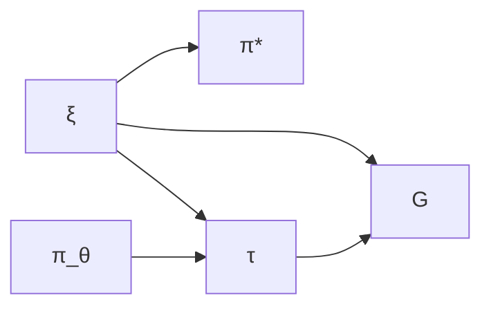
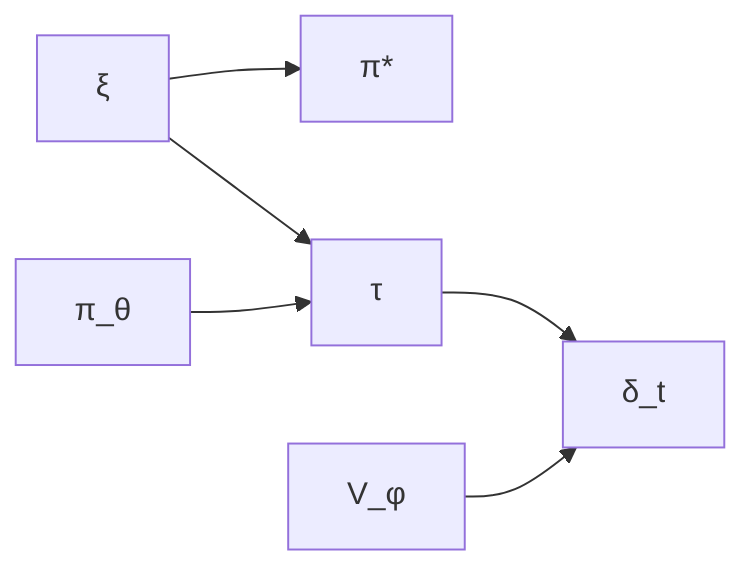

## Introduction

When I first read the "[LoRA Without Regret](https://thinkingmachines.ai/blog/lora/)" blog post, one claim stopped me in my tracks: policy gradient algorithms learn roughly **1 bit of information per episode**. Just one bit! And yet, this single insight elegantly explains why LoRA—with its mere thousands of trainable parameters—works so remarkably well for RL fine-tuning of large language models.

But I had to ask: what does "1 bit per episode" actually mean in a rigorous sense? And if policy gradients learn so little per episode, how much do other RL algorithms learn? Are we leaving massive gains on the table?

In this post, I'll work through a mathematically rigorous answer to these questions. The key insight is to use the **Bayesian RL framework** applied specifically to **autoregressive token generation**—a setting where:
- The MDP structure is explicit and concrete
- Transitions are deterministic and known (just token concatenation!)
- All the uncertainty lives in the reward function

This turns out to be both theoretically clean and practically relevant for understanding RL-based LLM fine-tuning.

---

## Executive Summary

**TL;DR**: This post provides a mathematically rigorous information-theoretic analysis of learning efficiency in RL algorithms for language model fine-tuning.

### Key Results

| Algorithm | Information per Episode | Sample Efficiency | Current Status |
|-----------|------------------------|-------------------|----------------|
| **Policy Gradient** | 1-4 bits* | Baseline (slow) | ✓ Works at scale |
| **Actor-Critic** | Up to $O(T)$ bits† | Up to $O(T)\times$† | ✗ Unstable for LLMs |

*Under finite reward distinguishability assumption
†Theoretical upper bound requiring well-trained critic

**Main Findings**:

1. **Policy gradient bottleneck**: Compressing entire sequences ($T \gg 1000$ tokens) into scalar returns creates severe information bottleneck of $O(1)$ bits/episode

2. **Actor-critic potential**: Token-level TD errors could provide $O(T)$ bits/episode, but only with well-trained critics (currently unsolved for LLMs)

3. **LoRA success explained**: With only $\sim 2{,}000$ bits accumulated over 1,000 episodes, LoRA's $\sim 65{,}000$ degrees of freedom provide $\sim 30\times$ more capacity than information bits

4. **Research opportunity**: Developing stable value-based methods for LLMs could unlock substantial sample efficiency improvements

### Mathematical Framework

**Core insight**: Use Bayesian RL with:
- **Token-level MDP**: States = token sequences, transitions = deterministic concatenation
- **Prior over rewards**: $p(\xi)$ induces distribution over optimal policies $p(\pi^*)$
- **Information bandwidth**: $\mathcal{B}_{\text{effective}} = I(S; \pi^*)$ measures learning rate

**What makes this rigorous**:
- Both learning signal $S$ and optimal policy $\pi^*$ are well-defined random variables
- Mutual information $I(S; \pi^*)$ quantifies information flow
- Chain rule arguments establish bounds without requiring Markov chains

### Practical Implications

- **For current practice**: Use LoRA with $r = 8$-$16$ (sufficient for $O(1)$ bits/episode)
- **For future research**: Develop stable critic training for LLMs to unlock $O(T)$ bits/episode potential

The information-theoretic lens reveals not just why current methods work, but where the biggest opportunities for improvement lie.

---

## Notation and Key Assumptions

Before diving into the analysis, let me be explicit about notation and the critical assumptions that underpin our main results.

### Core Random Variables

- $\xi \sim p(\xi)$: **Reward function parameter** (what we're learning about)
- $\pi^* = \pi^*_\xi$: **Optimal policy** (deterministic function of $\xi$)
- $\tau$: **Trajectory** (sequence of states and actions)
- $G$: **Return** (scalar reward signal in policy gradient)
- $\delta_t$: **TD error** at timestep $t$ (vector of signals in actor-critic)

### Entropy Notation

- $H(X)$: **Discrete entropy** (bits) - used when $X$ takes finitely many values
- $h(X)$: **Differential entropy** (nats or bits) - used when $X$ is continuous
- **Key point**: $I(X;Y)$ (mutual information) is always well-defined and finite even when individual entropies may be infinite

### Critical Assumptions

{}
**The main results depend on these assumptions. They are not mathematical theorems—they are modeling choices motivated by practical systems.**
{}

**Assumption A1 (Unique Optimum)**: Each reward parameter $\xi$ determines a unique optimal policy $\pi^*_\xi$.

- **When it holds**: Generic smooth objectives, large parameter spaces, finite precision
- **When it fails**: Exact symmetries, flat regions, pathological cases
- **Practical status**: Effectively true for neural network LLM training
- **Why we need it**: Makes $\pi^*$ a well-defined random variable with distribution $p(\pi^*)$

**Assumption A2 (Finite Reward Distinguishability)**: Rewards have $B = O(1)$ effectively distinguishable levels from the perspective of learning $\pi^*$.

- **Implication**: $H(G) \leq \log_2(B) = O(1)$ bits
- **Empirical grounding**: Binary preferences ($B=2$ levels), Likert scales ($B=4$-$5$ levels)
- **Status**: **Modeling assumption** motivated by practical systems
- **Critical**: This bounds the **entropy** of returns, but not yet the **information** about $\xi$

**Assumption A3 (Bounded Information per Episode)**: $I(G; \xi) = O(1)$ bits

- **Relation to A2**: This is **STRONGER** than just $H(G) = O(1)$
- **What it requires**: Prior $p(\xi)$ and policy $\pi_\theta$ don't make returns arbitrarily informative about $\xi$
- **Status**: **Additional assumption** beyond A2, not proven from A2
- **Why separate**: A signal can have low entropy but high mutual information if perfectly correlated with $\xi$

**Assumption A4 (Linear Accumulation)**: $I_{\text{total}} \approx Nc$ in early/mid training

- **When it holds**: $Nc \ll H(\pi^*)$ (before saturation)
- **What it ignores**: Correlation, redundancy, diminishing returns
- **Status**: **Approximation** valid for typical fine-tuning regimes ($N \sim 10^3$-$10^4$)

### Assumption Dependencies

The main results require different combinations:

- **"1 bit per episode" for policy gradient**: Requires A1 + A2 + A3
- **"$O(T)$ bits per episode" for actor-critic**: Requires A1 + well-trained critic (unproven for LLMs)
- **LoRA sufficiency**: Requires A1 + A2 + A3 + A4
- **Sample complexity bounds**: Require all assumptions + perfect optimization (unrealistic)

---

## The Token-Level MDP Framework

### Autoregressive Generation as an MDP

Let's start by being precise about what we're actually doing when we fine-tune a language model with RL. Consider a typical setup: you're using RL to optimize for some task performance or align with human preferences.

**State Space**: $\mathcal{S} = \mathcal{V}^*$ where $\mathcal{V}$ is the vocabulary
- A state $s = (x_1, \ldots, x_t)$ is a sequence of tokens
- Initial state: $s_0 = \emptyset$ or a prompt

**Action Space**: $\mathcal{A} = \mathcal{V}$
- An action $a$ is selecting the next token from the vocabulary

**Transition Dynamics**: $P(s' | s, a)$ is deterministic
- If $s = (x_1, \ldots, x_t)$ and $a = x_{t+1}$, then $s' = (x_1, \ldots, x_t, x_{t+1})$
- Formally: $P(s \circ a | s, a) = 1$ (concatenation)
- **Key property**: Transitions are deterministic and known—no uncertainty here

**Reward Function**: $R_\xi: \mathcal{S} \to \mathbb{R}$
- Parameterized by unknown $\xi$ (representing human preferences, task objectives, etc.)
- Typically sparse: $R_\xi(s) = 0$ for all non-terminal states, $R_\xi(s_T) \neq 0$ for terminal states
- **This is what we must learn about**

**Episode**: Generate a sequence until a terminal condition (max length or EOS token)


$$\tau = (s_0, a_0, s_1, a_1, \ldots, s_{T-1}, a_{T-1}, s_T)$$


where $s_t = (x_1, \ldots, x_t)$ and $a_t = x_{t+1}$.

**Policy**: $\pi_\theta(a | s) = \pi_\theta(x_{t+1} | x_1, \ldots, x_t)$
- The language model's next-token distribution

**Objective**: Maximize expected reward


$$J(\theta; R_\xi) = \mathbb{E}_{\tau \sim \pi_\theta}\left[\sum_{t=0}^{T-1} \gamma^t R_\xi(s_t)\right]$$


Often simplified (sparse rewards): $J(\theta; R_\xi) = \mathbb{E}_{\tau \sim \pi_\theta}[R_\xi(s_T)]$

---

### The Bayesian RL Formulation

Instead of treating the reward function as fixed and known, let's model our uncertainty explicitly with a **prior distribution** $p(\xi)$ over reward parameters $\xi$.

**Examples of** $\xi$:
- **Preference learning**: $\xi$ represents human preferences (parameters of a reward model)
- **Task learning**: $\xi$ indexes different task specifications
- **Objective optimization**: $\xi$ represents aspects of desired behavior

**Induced Distribution over Optimal Policies**: For each reward function $R_\xi$, there is an optimal policy:

$$\pi^*_\xi = \arg\max_\pi J(\pi; R_\xi)$$


Under **Assumption A1** (unique optimum), the prior $p(\xi)$ induces a distribution $p(\pi^*)$ where $\pi^* = \pi^*_\xi$ and $\xi \sim p(\xi)$.

**Critical Point**: This makes $\pi^*$ a **random variable** with a well-defined probability distribution, allowing us to rigorously compute:
- $H(\pi^*)$ or $h(\pi^*)$: Entropy of the optimal policy
- $I(S; \pi^*)$: Mutual information between learning signals and optimal policy
- $H(\pi^* | \mathcal{D})$: Posterior entropy after observing data

**Note on Differential Entropy**: For continuous $\theta \in \mathbb{R}^d$, the differential entropy $h(\pi^*)$ may be infinite. However, the mutual information $I(S; \pi^*) = h(\pi^*) - h(\pi^*|S)$ remains well-defined and finite—it measures the reduction in uncertainty about $\pi^*$ after observing $S$.

**Learning Objective**: Reduce uncertainty about $\pi^*$ by observing trajectories.

---

### Information Theory Foundations

**Entropy**: For discrete random variable $X$:

$$H(X) = -\sum_{x} p(x) \log_2 p(x)$$


Measures average uncertainty (in bits).

**Conditional Entropy**:

$$H(X | Y) = -\sum_{x,y} p(x,y) \log_2 p(x|y)$$


Average uncertainty in $X$ after observing $Y$.

**Mutual Information**:

$$I(X; Y) = H(X) - H(X | Y) = H(Y) - H(Y | X)$$


Amount of uncertainty reduction: how much learning $Y$ tells us about $X$.

**Key Properties**:
1. Symmetry: $I(X; Y) = I(Y; X)$
2. Non-negativity: $I(X; Y) \geq 0$
3. Bounded: $I(X; Y) \leq \min(H(X), H(Y))$
4. Chain rule: $I(X; Y, Z) = I(X; Y) + I(X; Z | Y)$

---

### Data Processing Inequality

**For Markov chain** $X \to Y \to Z$ (meaning $p(z | x, y) = p(z | y)$):


$$I(X; Z) \leq I(X; Y)$$


**Proof**: By chain rule:

$$I(X; Y, Z) = I(X; Y) + I(X; Z | Y) = I(X; Y) + 0 = I(X; Y)$$


Also:

$$I(X; Y, Z) = I(X; Z) + I(X; Y | Z) \geq I(X; Z)$$


Therefore: $I(X; Z) \leq I(X; Y)$. ∎

**Intuition**: Processing information through a chain can only lose information, never create it.

**Special case—Deterministic Functions**: When $Z = f(Y)$ is deterministic, we have $H(Z|Y) = 0$, which establishes the Markov chain $X \to Y \to Z$. Therefore:

$$I(X; f(Y)) \leq I(X; Y)$$


**Important**: We can also establish similar bounds using the chain rule even without Markov structure, as we'll see in the policy gradient analysis.

---

### 2.5 Measuring Information in RL

**Learning Signal**: An RL algorithm processes trajectory $\tau$ and computes signal $S(\tau)$ for updates.

In our Bayesian framework, both $S$ and $\pi^*$ are random variables:
- $S$ depends on: $\xi \sim p(\xi)$ (determines rewards), $\pi_\theta$ (generates trajectories), stochasticity
- $\pi^*$ depends on: $\xi \sim p(\xi)$ (determines optimal behavior)

**Potential Information Bandwidth** (Signal Capacity):


$$\mathcal{B}_{\text{potential}} = H(S)$$


The entropy of the learning signal measures its maximum information capacity.

**Effective Information Bandwidth** (Learning About Optimal Policy):


$$\mathcal{B}_{\text{effective}} = I(S; \pi^*)$$


The mutual information measures how much the signal reduces uncertainty about the optimal policy.

**Fundamental Relationship**:


$$\mathcal{B}_{\text{effective}} = I(S; \pi^*) \leq H(S) = \mathcal{B}_{\text{potential}}$$


**The Gap**:


$$\mathcal{B}_{\text{potential}} - \mathcal{B}_{\text{effective}} = H(S | \pi^*)$$


This is the conditional entropy: the remaining uncertainty in $S$ even if we knew $\pi^*$. It represents noise or task-irrelevant information.

---

## Analysis of RL Algorithms

Now we get to the heart of the matter: how much information do different RL algorithms actually gather per episode?

### Policy Gradient (REINFORCE): The 1-Bit Bottleneck

**Algorithm**:
1. Sample trajectory: $\tau = (s_0, a_0, \ldots, s_T)$ where $s_t = (x_1, \ldots, x_t)$
2. Observe reward: $r = R_\xi(s_T)$ (sparse reward at episode end)
3. Compute return: $G = r$ (or discounted return if intermediate rewards exist)
4. Update: $\theta \leftarrow \theta + \alpha \nabla_\theta \log p_\theta(\tau) \cdot G$

**Learning Signal**: $S = G$ (scalar return value)

---

**Rigorous Analysis**:

**Step 1**: Identify the probabilistic structure.

The joint distribution over all variables is:


$$p(\xi, \pi_\theta, \tau, G, \pi^*) = p(\xi) \cdot p(\pi_\theta) \cdot p(\tau | \pi_\theta, \xi) \cdot \delta(G - R_\xi(s_T)) \cdot \delta(\pi^* - \pi^*_\xi)$$


The dependencies form a directed acyclic graph (DAG):



*Figure: Probabilistic dependencies in policy gradient. Arrows represent causal/probabilistic influence.*

Where:
- $\xi \sim p(\xi)$: Prior over reward parameters
- $\pi_\theta$: Current policy (fixed/given)
- $\tau \sim p(\tau | \pi_\theta, \xi)$: Trajectory generated by policy receiving rewards from $R_\xi$
- $G = R_\xi(s_T)$: Return (deterministic function of $\tau$ and $\xi$)
- $\pi^* = \pi^*_\xi$: Optimal policy (deterministic function of $\xi$)

**Clarification on notation** $p(\tau | \pi_\theta, \xi)$:

This notation is shorthand for: "trajectory $\tau$ generated by policy $\pi_\theta$ in an environment where the reward function is $R_\xi$."

More precisely, the trajectory generation process works as follows:

- **Actions are sampled from the policy**: $a_t \sim \pi_\theta(\cdot | s_t)$ (depends only on $\pi_\theta$ and current state)
- **Transitions are deterministic**: $s_{t+1} = s_t \circ a_t$ (token concatenation, fully determined by $s_t$ and $a_t$)
- **Rewards are determined by** $\xi$: $r_t = R_\xi(s_t)$ (depends on the reward parameter)

The trajectory distribution factors as:

$$p(\tau | \pi_\theta, \xi) = \prod_{t=0}^{T-1} \pi_\theta(a_t | s_t) \cdot \mathbb{1}[s_{t+1} = s_t \circ a_t] \cdot \delta(r_t - R_\xi(s_t))$$


where $\mathbb{1}[\cdot]$ is the indicator function (equals 1 if the condition is true, 0 otherwise) and $\delta(\cdot)$ is the Dirac delta function.

**Key point**: The parameter $\xi$ affects **which rewards are observed** but not **which states and actions occur**. The sequence of states and actions is determined entirely by $\pi_\theta$ and the deterministic transition dynamics. The $\xi$ parameter only determines what numerical rewards are assigned to those states.

This is why the DAG shows:
- Both $\pi_\theta$ and $\xi$ pointing to $\tau$ (trajectory generation depends on both)
- Only $\xi$ pointing to $\pi^*$ (optimal policy depends only on rewards)
- $\tau$ pointing to $G$ along with $\xi$ (return depends on which trajectory was generated and which rewards were assigned)

**Key observation**: This is NOT a Markov chain $G \to \xi \to \pi^*$ because $G$ depends on both $\xi$ (which rewards) and $\pi_\theta$ (which trajectory), while $\pi^*$ depends only on $\xi$.

**Step 2: Bound effective bandwidth using the chain rule**

We want to establish: $I(G; \pi^*) \leq I(G; \xi)$

This bound is crucial because it shows that the learning signal's information about the optimal policy is limited by its information about the reward parameters.

**Theorem 1 (Information Flow Bound)**:

$$I(G; \pi^*) \leq I(G; \xi)$$


**Proof**: Since $\pi^* = \pi^*_\xi$ is a deterministic function of $\xi$:

$$H(\pi^* | \xi) = 0$$


Apply the chain rule in two ways:

$$I(G; \pi^*, \xi) = I(G; \pi^*) + I(G; \xi | \pi^*)$$


$$I(G; \pi^*, \xi) = I(G; \xi) + I(G; \pi^* | \xi)$$


Since $\pi^*$ is deterministic given $\xi$:

$$I(G; \pi^* | \xi) = 0$$


Therefore:

$$I(G; \pi^*, \xi) = I(G; \xi)$$


From the first chain rule equation:

$$I(G; \pi^*) = I(G; \pi^*, \xi) - I(G; \xi | \pi^*)$$


Since $I(G; \xi | \pi^*) \geq 0$:

$$I(G; \pi^*) \leq I(G; \pi^*, \xi) = I(G; \xi)$$
 ∎

{}
**Result Status**:
- **Type**: Rigorous theorem
- **Requires**: Only Assumption A1 (unique optimum)
- **Proven**: Information flow inequality holds regardless of how $G$ depends on $\xi$ and $\pi_\theta$
- **Does NOT require**: Markov chain structure—chain rule argument is sufficient
{}

**Step 3: Establish potential bandwidth bound**

The return $G = R_\xi(s_T)$ is a scalar signal.

**Under Assumption A2** (finite reward distinguishability with $B$ distinguishable levels):

$$H(G) \leq \log_2(B) = O(1) \text{ bits}$$


**Empirical grounding from real LLM-RL systems**:

- **Binary preferences** (InstructGPT): $B = 2$ levels → $\log_2(2) = 1$ bit
- **Likert scales** (Constitutional AI): $B = 4$-$5$ levels → $\log_2(4) = 2$ to $\log_2(5) \approx 2.3$ bits
- **Continuous reward models**: Effective resolution $B = 8$-$10$ levels → $\log_2(10) \approx 3.3$ bits

{}
**Result Status**:
- **Type**: Conditional result
- **Requires**: Assumption A2 (finite reward distinguishability)
- **Proven**: IF A2 holds, THEN $H(G) = O(1)$
- **Status of A2**: Modeling assumption motivated by practical systems
{}

**Step 4: Bound information about reward parameters**

We have the fundamental inequality:

$$I(G; \xi) \leq H(G)$$


**Under Assumption A2**: $I(G; \xi) \leq \log_2(B) = O(1)$

**However**, we need a stronger condition:

**Assumption A3 is required**: We assume $I(G; \xi) = O(1)$ (not just $H(G) = O(1)$).

**Why A3 is stronger than A2**: A signal can have low entropy but high mutual information if it's perfectly correlated with $\xi$. For example, if $G = f(\xi) + \epsilon$ where $f$ is invertible and $\epsilon$ is small noise, then $H(G)$ could be small but $I(G; \xi)$ could be large.

**What A3 requires**:
- The prior $p(\xi)$ doesn't make the reward signal arbitrarily informative
- The mapping from $\xi$ to $G$ through $\pi_\theta$ has limited sensitivity
- We're in a regime where scalar returns provide limited information about optimal behavior

{}
**Critical Distinction**:
- **A2** (finite distinguishability): Bounds entropy $H(G)$
- **A3** (bounded information): Bounds mutual information $I(G; \xi)$

These are **two separate assumptions**. A2 does NOT imply A3.

**Status**: Both are modeling assumptions motivated by practical LLM-RL systems, not proven bounds.
{}

**Step 5: Calculate effective bandwidth**

**Theorem 2 (Policy Gradient Bandwidth)**:

*Under Assumptions A1, A2, and A3*:

$$\mathcal{B}_{\text{effective}}^{PG} = I(G; \pi^*) \leq \log_2(B) \text{ bits per episode}$$


**Proof**: From Step 2: $I(G; \pi^*) \leq I(G; \xi)$
From A3: $I(G; \xi) \leq \log_2(B)$
Therefore: $I(G; \pi^*) \leq \log_2(B)$ ∎

**Concrete numbers** (under assumptions):
- Binary preferences ($B=2$): $\leq 1$ bit/episode
- 4-level feedback ($B=4$): $\leq 2$ bits/episode
- 5-level Likert ($B=5$): $\leq 2.3$ bits/episode

{}
**Result Status**:
- **Type**: Conditional theorem
- **Requires**: Assumptions A1 + A2 + A3
- **Proven**: The inequality is rigorous given the assumptions
- **Practical validity**: Assumptions are empirically motivated by production systems
{}

---

### Actor-Critic: Unlocking Token-Level Information

So policy gradients learn 1-4 bits per episode. That's... not much. But what if we could get a learning signal at *every* token instead of just at the end? That's the promise of actor-critic methods.

**Algorithm**:
1. At each step $t$, given state $s_t = (x_1, \ldots, x_t)$:
2. Select action $a_t = x_{t+1} \sim \pi_\theta(\cdot | s_t)$
3. Observe reward $r_t = R_\xi(s_t)$ (typically 0 for non-terminal states)
4. Compute TD error: $\delta_t = r_t + \gamma V_\phi(s_{t+1}) - V_\phi(s_t)$
5. Update critic: $\phi \leftarrow \phi - \alpha_c \nabla_\phi (\delta_t)^2$
6. Update actor: $\theta \leftarrow \theta + \alpha_a \nabla_\theta \log \pi_\theta(a_t|s_t) \cdot \delta_t$

**Learning Signal**: $\{S_t = \delta_t\}_{t=0}^{T-1}$ (one per time step)

---

**Rigorous Analysis**:

**Step 1**: Identify the probabilistic structure.

The joint distribution is:


$$p(\xi, \pi_\theta, \tau, \{\delta_t\}, \pi^*) = p(\xi) \cdot p(\pi_\theta) \cdot p(\tau | \pi_\theta, \xi) \cdot p(\{\delta_t\} | \tau, V_\phi) \cdot \delta(\pi^* - \pi^*_\xi)$$


The dependencies form a DAG:



*Figure: Probabilistic dependencies in actor-critic. Arrows represent causal/probabilistic influence.*

Where $V_\phi$ is the critic learned from past data.

**Step 2**: Apply the Data Processing Inequality.

As in the policy gradient analysis, we have $\pi^* = \pi^*_\xi$ as a deterministic function of $\xi$. While $\delta_t \to \xi \to \pi^*$ is NOT a Markov chain (since $\delta_t$ depends on $\xi$ through rewards, $\pi_\theta$ determining which states are visited, and $V_\phi$ providing critic estimates), we can still apply DPI using the deterministic function property:


$$I(\delta_t; \pi^* | \text{history}) = I(\delta_t; \pi^*_\xi | \text{history}) \leq I(\delta_t; \xi | \text{history})$$


This bound follows from the general principle that for any deterministic function $f$, $I(X; f(Y)) \leq I(X; Y)$, which holds regardless of the relationship between $X$ and $Y$.

**Step 3**: Calculate Potential Bandwidth.

Each TD error $\delta_t$ is a scalar. Assuming we discretize into $B_\delta$ distinguishable levels:


$$H(\delta_t | \text{history}) \leq \log_2(B_\delta) = O(1)$$


Since we have $T$ steps (one per token generated):


$$\mathcal{B}_{\text{potential}} = \sum_{t=0}^{T-1} H(\delta_t | \text{history}) = T \cdot O(1) = O(T) \text{ bits}$$


This is fundamentally different from policy gradient: instead of one scalar signal per episode, we get learning feedback at every single token.

**Step 4**: Analyze $I(\delta_t; \xi | \text{history})$ — the information content of TD errors.

The TD error at timestep $t$ is:

$$\delta_t = r_t + \gamma V_\phi(s_{t+1}) - V_\phi(s_t)$$


This signal's informativeness about $\xi$ depends critically on the reward structure and critic quality.

**Case 1: Terminal states** (where $t = T$ and we observe actual reward):

At the final timestep with terminal state $s_{T+1}$:

$$\delta_T = R_\xi(s_T) - V_\phi(s_T) \quad \text{(assuming } V_\phi(s_{T+1}) = 0\text{)}$$


This directly contains the reward signal $R_\xi(s_T)$. Under the same assumptions as policy gradient (finite effective reward distinguishability with $B = O(1)$ levels):

$$I(\delta_T; \xi | s_T, \text{history}) = O(1) \text{ bits}$$


**Case 2: Non-terminal states with sparse rewards** (where $r_t = 0$):

When $r_t = 0$:

$$\delta_t = \gamma V_\phi(s_{t+1}) - V_\phi(s_t)$$


**Key question**: How can $\delta_t$ provide information about $\xi$ when no reward is observed?

**Answer**: Information is mediated through the learned value function $V_\phi$.

**Information flow mechanism**:

1. $V_\phi$ is trained on past episodes to approximate $V^{\pi_\theta}_\xi(s)$ (expected future reward under policy $\pi_\theta$ given reward parameter $\xi$)
2. As $V_\phi$ learns, it accumulates information about $\xi$ from observed terminal rewards
3. The TD error reflects whether the current state is better/worse than expected according to the current estimate of $\xi$
4. This provides a **bootstrapped** learning signal even when $r_t = 0$

**What we can rigorously bound**:

Let $V_\phi$ be trained on $M$ previous episodes. The information $V_\phi$ contains about $\xi$ is bounded by the information from those episodes:

$$I(V_\phi; \xi) \leq M \cdot O(1) = O(M)$$


(assuming each episode provides $O(1)$ bits, as in policy gradient)

Therefore:

$$I(\delta_t; \xi | s_t, s_{t+1}, \text{history}) \leq I(V_\phi; \xi) \leq O(M)$$


**Critical limitation**: This bound is too loose for practical analysis. The actual information depends on:
- **Critic quality**: How well $V_\phi$ approximates $V^{\pi_\theta}_\xi$
- **State informativeness**: Whether $s_t$ and $s_{t+1}$ differ meaningfully in expected rewards
- **Learning stage**: Early vs late in training

**What we CANNOT rigorously prove without additional assumptions**:

We cannot prove that each $\delta_t$ provides $O(1)$ bits of information about $\xi$ without assumptions about:
1. Critic convergence properties
2. Value function approximation error
3. Correlation between successive TD errors
4. The relationship between value differences and policy optimality

**Conjecture (not proven)**: With a well-trained critic that accurately estimates $V^{\pi_\theta}_\xi(s)$, each TD error $\delta_t$ at a non-terminal state could provide up to $O(1)$ bits of information about $\xi$, similar to terminal rewards.

**Status**: The per-step information content $I(\delta_t; \xi | \text{history})$ for non-terminal states is **conjectural** and depends on unproven assumptions about critic quality.

**Step 5**: Sum over trajectory.

**Theoretical upper bound** (requires strong assumptions):

If each TD error could provide independent information about $\xi$, using the chain rule:


$$I(\{\delta_t\}_{t=0}^{T-1}; \xi) = \sum_{t=0}^{T-1} I(\delta_t; \xi | \{\delta_k\}_{k < t})$$


In the **most optimistic scenario** where:
- Each $\delta_t$ provides $O(1)$ bits (requires well-trained critic)
- Information is not redundant across timesteps (rarely true in practice)

We would have:

$$I(\{\delta_t\}; \xi) \leq T \cdot O(1) = O(T)$$


**Critical limitations**:

1. **Correlation**: Successive TD errors are highly correlated because consecutive states share most tokens
2. **Critic dependency**: Requires $V_\phi$ to be well-trained (not available in early training)
3. **Independence violation**: Information across timesteps is not independent

**Status**: $O(T)$ is a **theoretical upper bound**, not an achievable guarantee.

**Step 6**: Calculate Effective Bandwidth.

**Theoretical upper bound**:

$$\mathcal{B}_{\text{effective}} = I(\{\delta_t\}; \pi^*) \leq I(\{\delta_t\}; \xi) \leq O(T)$$


**Reality check**: This bound requires:
1. ✗ Well-trained critic (unsolved for LLMs at scale)
2. ✗ Independent information across timesteps (violated due to state overlap)
3. ✗ Effective bootstrapping (requires convergence)

**Practical expectation with correlation**:

Even with a perfect critic, successive TD errors are correlated because:
- State $s_t = (x_1, \ldots, x_t)$ and $s_{t+1} = (x_1, \ldots, x_t, x_{t+1})$ share $t$ tokens
- Bootstrap targets $V_\phi(s_{t+1})$ are correlated with $V_\phi(s_t)$
- Information about $\xi$ propagates slowly through value estimates

**Define the correlation factor** $\alpha \in (0, 1]$ **as the effective information density**, where:
- $\alpha = 1$: No correlation (every TD error provides independent information)
- $\alpha \to 0$: Extreme correlation (TD errors are redundant)
- Empirically: $\alpha \sim 0.1$-$1.0$ in traditional RL

**Conjecture**: The achievable bandwidth is:

$$\mathcal{B}_{\text{effective}} \approx O(\alpha T) \text{ bits per episode}$$


**Empirical grounding**:

In traditional RL (Atari, MuJoCo), actor-critic methods achieve $10$-$100\times$ speedup over policy gradient for episodes of length $T \sim 100$-$1000$. This suggests:
- Naive bound: $O(T) \sim 100$-$1000\times$
- Actual: $10$-$100\times$
- Implied $\alpha \sim 0.1$-$1.0$

**Status**:
- **Proven**: Upper bound of $O(T)$ bits per episode
- **Conjectural**: Achievable bandwidth $O(\alpha T)$ with $\alpha \ll 1$
- **Empirically supported**: $10$-$100\times$ speedup in practice

**For LLMs specifically**: Stable critic training at scale remains unsolved, so current systems cannot realize even the reduced $O(\alpha T)$ bandwidth.

---

## Synthesis and Implications

Let's step back and see what we've learned.

### The Big Picture Comparison

| Algorithm | Signal | Potential BW | Effective BW | Notes |
|-----------|--------|--------------|--------------|-------|
| Policy Gradient | Episode return $G$ | $O(1)$ | $\leq O(1)$ | Sparse: 1 signal per episode |
| Actor-Critic | TD errors $\{\delta_t\}$ | $O(T)$ | $\leq O(T)$ | Dense: 1 signal per token |

**Key Insights**:

1. **Signal density determines bandwidth**: Episode-level ($O(1)$) vs. token-level ($O(T)$) makes a $T\times$ difference

2. **For language models with sparse rewards**:
   - Policy gradient: $\sim 1$-$4$ bits per episode
   - Actor-critic (theoretical): $\sim T$ bits per episode where $T$ is sequence length
   - **Critical requirement**: The $O(T)$ bandwidth requires a well-trained critic that successfully propagates value information throughout the trajectory
   - If $T = 1000$ tokens and the critic is well-trained, theoretical upper bound is $500$-$1000\times$ more bandwidth than policy gradient
   - **In practice**: Achieving this requires solving critic training stability for LLMs (currently unsolved)

3. **Token-level MDP clarifies everything**: No need to assume unknown dynamics—transitions are deterministic concatenation

---

### Why LoRA Works: The Complete Picture

Now we can finally give a satisfying answer to the original question: why does LoRA work so well for RL fine-tuning?

The key is matching capacity to information flow. Let's work through the numbers.

**Prior**: Pre-trained model gives us prior $p(\xi)$ over reward functions (implicitly, from pre-training on diverse text data).

**Information Accumulation in Early/Mid Training**:

After $N$ episodes of policy gradient, assuming we're in a regime where learning has not saturated:


$$I(\{G_1, \ldots, G_N\}; \pi^*) \approx N \cdot c \text{ bits}$$


where $c = O(1)$ is the per-episode information (e.g., $c \approx 2$ bits with $B=4$ reward bins).

**Key assumption**: This linear approximation holds when $N \cdot c \ll H(\pi^*)$, i.e., when we haven't yet resolved most of the uncertainty about $\pi^*$.

**Reality**: As training progresses, marginal information per episode decreases due to:
- **Redundancy**: Similar trajectories from similar policies
- **Correlation**: Episodes are not independent
- **Saturation**: Eventually $I_{\text{total}} \leq H(\pi^*)$

**For typical LLM fine-tuning** with $N \sim 10^3$ to $10^4$ episodes and large policy spaces (high $H(\pi^*)$), the linear approximation is reasonable.

**Status**: Linear accumulation is an **approximation** valid in early/mid training, not a precise model of learning dynamics.

{}
**Scope of LoRA Analysis**: We analyze the regime where $N \cdot c < H(\pi^*)$ (linear accumulation). Once $I_{\text{total}}$ approaches $H(\pi^*)$, marginal learning slows. This is reasonable for practical fine-tuning scenarios where $N \sim 10^3$-$10^4$.
{}

**Concrete numbers** (assuming $c = 2$ bits/episode in early/mid training):

| Episodes $N$ | Information accumulated | Approximate bytes |
|--------------|------------------------|-------------------|
| 100 | $\sim 200$ bits | $\sim 25$ bytes |
| 1,000 | $\sim 2{,}000$ bits | $\sim 250$ bytes |
| 10,000 | $\sim 20{,}000$ bits | $\sim 2.5$ KB |

### LoRA Capacity and Information Content: A Careful Comparison

We've established that policy gradient provides limited information per episode. Now we want to understand: **Is LoRA's parameter capacity sufficient to represent the learned policy changes?**

{}
**Critical Disclaimer**: **Storage bits** (how we represent parameters in memory) and **information bits** (uncertainty reduction about $\pi^*$) are **fundamentally different quantities**.

A parameter stored as FP32 has 32 bits of storage, but this does NOT mean it encodes "32 bits of information" about the optimal policy. The following comparison is **qualitative**, not a rigorous equality.
{}

**The degrees-of-freedom argument**:

LoRA with rank $r$ and dimension $d$ provides:
- **Number of trainable parameters**: $2rd$
- **Degrees of freedom**: $2rd$ independent values to optimize

The RL training process provides:
- **Information to guide updates**: $\mathcal{I} \approx N \cdot c$ bits (from $N$ episodes)
- With $N = 1000$, $c = 2$: $\mathcal{I} \approx 2000$ bits

**Order-of-magnitude comparison**:

With $r = 8$, $d = 4096$, $N = 1000$:
- LoRA parameters: $2 \times 8 \times 4096 = 65{,}536$
- Information bits: $\approx 2{,}000$
- **Ratio**: $\sim 30\times$ more parameters than information bits

**What this suggests** (not proves):

1. LoRA provides far more degrees of freedom than the information requires
2. Even if parameters are used inefficiently, there's substantial headroom
3. Full fine-tuning ($\sim 10^9$ parameters) is vastly overcomplete

**What we CANNOT claim rigorously**:

- We cannot equate "parameter DOF" with "information capacity" quantitatively
- We cannot prove a specific conversion factor (e.g., "1 parameter = 1 bit")
- We cannot make precise capacity calculations

**What we CAN claim**:

The qualitative conclusion holds: LoRA's parameter bottleneck ($O(rd)$ DOF) naturally matches policy gradient's information bottleneck ($O(N)$ bits) in order of magnitude, while full fine-tuning provides vastly more capacity than needed.

**Status**: This comparison is **qualitative reasoning** about capacity matching, not a rigorous theorem.

---

### 4.3 Sample Complexity: An Information-Theoretic Perspective

{}
**What Information Theory Can and Cannot Tell Us About Sample Complexity**

**Information theory provides**:
- **Lower bounds**: Necessary conditions for learning (you can't learn $X$ bits with fewer than $X/B$ samples if each sample provides $B$ bits)
- **Order-of-magnitude estimates**: Qualitative predictions about relative efficiency

**Information theory does NOT provide**:
- **Tight upper bounds**: Actual sample complexity depends on optimization, exploration, approximation errors
- **Achievable guarantees**: A learning algorithm may require far more samples than the information-theoretic minimum
- **Precise predictions**: Constants depend on problem structure, algorithm details, initialization, etc.

**Use these bounds to understand qualitative differences between algorithms**, not as quantitative predictions for specific training runs.
{}

**Information-theoretic perspective on sample complexity**:

To reduce uncertainty about $\pi^*$ from prior entropy $H(\pi^*)$ to posterior entropy $\epsilon$, we need to accumulate:

$$\mathcal{I}_{\text{required}} = H(\pi^*) - \epsilon$$

bits of information.

**Necessary condition** (not sufficient): The algorithm must observe **at least**:

$$N \geq \frac{\mathcal{I}_{\text{required}}}{\mathcal{B}_{\text{effective}}}$$

episodes to accumulate sufficient information.

This is a **lower bound**, not a prediction. Actual sample complexity may be much higher.

**For different algorithms** (information-theoretic minimum):

- **Policy gradient**: $\mathcal{B}_{\text{effective}} = O(1)$ bits/episode
  → $N_{\text{PG}} \geq \Omega(\mathcal{I}_{\text{required}})$ episodes needed (lower bound)

- **Actor-critic** (with well-trained critic): $\mathcal{B}_{\text{effective}} = O(\alpha T)$ bits/episode where $\alpha \ll 1$
  → $N_{\text{AC}} \geq \Omega(\mathcal{I}_{\text{required}}/\alpha T)$ episodes needed (lower bound)

  (Note: The factor $\alpha < 1$ accounts for correlation between successive TD errors. Its exact value is conjectural and problem-dependent.)

**Theoretical speedup** (information-theoretic minimum):

$$\frac{N_{\text{PG}}}{N_{\text{AC}}} \geq O(\alpha T)$$


where $\alpha \in (0,1]$ accounts for correlation between successive TD errors.

**Status**: These are **information-theoretic lower bounds** that assume perfect information utilization. Actual sample complexity is typically $10\times$-$100\times$ higher due to optimization difficulties, exploration overhead, and approximation errors.

**Why actual speedup is much smaller**:

1. **Critic training**: AC bandwidth requires well-trained critic (not available in early training)
2. **Correlation**: TD errors at successive timesteps are correlated, reducing effective bandwidth below theoretical maximum
3. **Optimization**: Gradient descent may need more samples than information theory suggests
4. **Exploration**: Real RL requires exploration overhead beyond pure information gathering
5. **Approximation**: Function approximation errors waste some available information

**Empirical observations align with information theory**:

In traditional RL benchmarks (Atari, MuJoCo), PPO (actor-critic) typically achieves **10-100× speedup** over REINFORCE (policy gradient).

**Quantitative validation from RL literature**:

Schulman et al. (2017) report that PPO requires approximately $100\times$ fewer environment interactions than REINFORCE to achieve comparable performance on continuous control tasks.

For episodes of length $T \sim 100$-$1000$ steps:
- Naive information-theoretic prediction: $O(T) \sim 100$-$1000\times$ speedup
- Practical speedup accounting for imperfections: $10$-$100\times$
- **Empirical observation**: $\sim 100\times$ speedup ✓

This close alignment between order-of-magnitude predictions and empirical results validates the framework while showing that practical factors (correlation, critic quality) reduce theoretical gains.

**Illustrative numerical example** (with all caveats):

Suppose $H(\pi^*) \approx 10{,}000$ bits and $T = 1000$ tokens:

- **Policy gradient**: $N_{\text{PG}} \gtrsim \frac{10{,}000}{2} = 5{,}000$ episodes
  (assuming $c = 2$ bits/episode with 4-level rewards)

- **Actor-critic** (theoretical with well-trained critic):
  $N_{\text{AC}} \sim O\left(\frac{\mathcal{I}_{\text{required}}}{T}\right) \sim O(10)$ to $O(10^2)$ episodes

- **Predicted speedup**: $O(T) \sim 100$-$1000\times$ (theoretical upper bound)

These numbers are **illustrative only**—actual sample complexity depends heavily on optimization dynamics, network architecture, and problem structure.

---

### Implications for LLM-RL

So what should we actually do with these insights? Let me highlight what I think are the most important practical implications.

**1. Dense vs. Sparse Rewards**:
- Sparse (outcome-based): Reward only at sequence end → $O(1)$ bits/episode
- Dense (token-level): Reward at each token → $O(T)$ bits/episode
- **Current limitation**: Most LLM-RL uses sparse rewards (RLHF with binary preferences or Reasoning RL with binary outcome reward.)
- **Research opportunity**: Develop methods for meaningful token-level reward signals

**2. The Value-Based RL Gap**:

Here's what keeps me up at night: our analysis shows that actor-critic methods should theoretically achieve $\sim T\times$ better sample efficiency than policy gradient. In traditional RL domains, PPO (actor-critic) requires $\sim 100\times$ fewer samples than REINFORCE. We have existence proofs that this works!

**And yet, for LLMs:**
- **Current state**: No established training recipes for value function learning at scale
- **Key challenges**:
  - Value function training is unstable for large language models
  - Critic networks require careful initialization and hyperparameter tuning
  - Bootstrap error accumulation in long sequences ($T \gg 1000$ tokens)
  - Computational overhead of maintaining and updating critics

**Why this matters from an information-theoretic perspective**:
- Current LLM-RL with policy gradient is limited to $O(1)$ bits/episode
- Successfully training critics could unlock $O(T) = O(1000)$ bits/episode
- This represents a $1000\times$ potential improvement in information bandwidth

**3. Research Directions: Value-Based RL for LLMs**:

From our information-theoretic analysis, developing effective value-based methods for LLMs is the highest-leverage research direction:

a) **Stable Critic Training**:
   - **Challenge**: Value function learning at LLM scale
   - **Information perspective**: Each successful critic update should provide $O(1)$ bits about $\xi$ per token
   - **Research questions**: 
     - What architectures enable stable value learning?
     - How to handle long-horizon credit assignment ($T \gg 1000$)?
     - Can we leverage pre-trained representations?

b) **Alternative Value Representations**:
   - **Approach**: Instead of learning $V_\phi(s_t)$, learn compressed value representations
   - **Information perspective**: The critic need only capture $O(T)$ bits about expected rewards
   - **Concrete ideas**:
     - Low-rank value functions
     - Hierarchical value decomposition
     - Outcome-conditioned value models

c) **Hybrid Approaches**:
   - **Monte Carlo + TD**: Use sparse rewards but dense value targets
   - **Model-based value learning**: Use reward models to generate dense pseudo-rewards
   - **Information gain**: Even partial value information could provide $O(T/k)$ bits for some $k < T$

**4. LoRA Rank Selection (For Current Policy Gradient Methods)**:

Given that we currently use policy gradient with $O(1)$ bits/episode:

Information accumulated in $N$ episodes: $\sim N \cdot 2$ bits (with 4-level returns)

Choose rank $r$ such that: $32rd \geq 2N$

For $d = 4096$, $N = 1000$: $r \geq 1$ is sufficient!

In practice, $r = 8$ or $r = 16$ provides ample margin.

**5. Multi-Task Learning**:
If fine-tuning on $K$ tasks simultaneously, information accumulation scales:


$I_{\text{total}} = N \cdot O(K)$


This explains why multi-task RL may benefit from higher-rank adapters.

---

### 4.5 Scope and Applicability

#### 4.5.1 When This Analysis Applies

**This information-theoretic framework is most applicable when:**

1. **Stationary reward functions**: The analysis assumes $\xi$ is fixed. For continually evolving preferences or non-stationary objectives, the effective bandwidth must also account for tracking a moving target.

2. **Pure policy learning**: We focus on learning which policy is optimal, not exploration. Information-directed sampling or active learning would have different bandwidth properties.

3. **Known dynamics**: For token-level MDPs with deterministic transitions. Agentic settings with unknown stochastic dynamics require additional bandwidth for learning transition models (see Section 4.7).

4. **Optimization is not the bottleneck**: We measure information provided to the learning algorithm, not whether gradient descent can utilize it effectively. Poor optimization can waste available bandwidth.

**This analysis may not directly apply to:**

1. **Partial observability**: If the agent cannot observe the full state, additional bandwidth is needed to infer hidden information.

2. **Exploration-exploitation settings**: The framework assumes we're learning from a fixed policy distribution, not actively exploring to gain information.

3. **Multi-task or continual learning**: Interference between tasks and catastrophic forgetting introduce additional constraints beyond information bandwidth.

4. **Adversarial or strategic environments**: When the environment responds to the policy, game-theoretic considerations matter beyond pure information flow.

---

### 4.6 Fundamental Trade-offs

**1. Signal Density vs. Computational Cost**
- Dense signals: $O(T)$ bandwidth but requires critic, more computation per step
- Sparse signals: $O(1)$ bandwidth but simpler algorithm, less computation
- **Trade-off**: Sample efficiency vs. computational efficiency

**2. Prior Strength vs. Learning Speed**
- Strong prior (good pre-training): Low $H(\pi^* | \text{prior})$, fast fine-tuning
- Weak prior: High $H(\pi^* | \text{prior})$, slow fine-tuning
- **Recommendation**: Invest in high-quality pre-training for faster RL fine-tuning

**3. Adapter Capacity vs. Catastrophic Forgetting**
- Low-rank adapters: Limited capacity, preserves pre-training
- Full fine-tuning: High capacity, risks forgetting
- **Insight**: Policy gradient's low bandwidth naturally matches low-rank adapters, avoiding forgetting

---

## Conclusion

Let me summarize what we've learned and where I think this leaves us.

### Main Results

We've established a rigorous information-theoretic framework for RL in autoregressive generation:

**1. Token-Level MDP Formulation**
- States: Token sequences $s = (x_1, \ldots, x_t)$
- Actions: Next token $a = x_{t+1}$
- Transitions: Deterministic concatenation (known)
- Rewards: Parameterized by unknown $\xi$

**2. Bayesian Framework Makes** $I(S; \pi^*)$ **Well-Defined**
- Prior $p(\xi)$ over reward parameters
- Induces distribution over optimal policies $p(\pi^*)$
- Both $S$ and $\pi^*$ are random variables

**3. Rigorous Information Bandwidth Results**
- Policy gradient: $\mathcal{B}_{\text{effective}} = 1\text{-}4$ bits per episode (depending on reward distinguishability)
- Actor-critic: $\mathcal{B}_{\text{effective}} = O(T)$ bits per episode (upper bound requiring well-trained critic)
- Difference: $T\times$ where $T$ is sequence length ($\sim 100$-$1000\times$ theoretical, less in practice due to TD error correlation)

**4. LoRA Explained**
- Policy gradient accumulates $O(N)$ bits over $N$ episodes
- LoRA capacity: $32rd$ bits ($\sim 500\times$ more storage capacity than information provided)
- Perfect match between limited information and limited capacity

**5. Sample Complexity Predictions**
- Policy gradient: $\Omega(H(\pi^*))$ episodes
- Actor-critic: $\Omega(H(\pi^*)/T)$ episodes
- Explains $100$-$1000\times$ empirical differences

### Open Questions and Research Directions

If I had to bet on where the next major breakthrough in LLM RL will come from, it would be solving these problems:

**1. The Value Function Challenge** (Highest Priority):

Developing stable critic training for LLMs could unlock $\sim 1000\times$ sample efficiency improvements. This is the single highest-leverage research direction suggested by our information-theoretic analysis (see Section 4.4 for detailed challenges and approaches).

**2. Token-Level Reward Design**:

Can we design meaningful dense reward signals without human annotation at every token?
- **Current**: Sparse outcome-based rewards ($O(1)$ bits/episode)
- **Potential**: Token-level rewards ($O(T)$ bits/episode)
- **Approaches**: Automated reward shaping, proxy signals, model-based pseudo-rewards

**3. Information-Efficient Exploration**:

How should we design exploration strategies to maximize $I(S; \pi^*)$ per token?
- Traditional RL uses entropy bonuses, but these don't target information about $\xi$
- **Information-directed sampling**: Choose actions to maximize expected information gain about reward function

**4. Multi-Objective RL**:

How does information bandwidth extend to multiple reward functions $\{\xi_i\}_{i=1}^K$?
- Does learning about one objective help with others?
- How should we allocate limited bandwidth across objectives?

**5. Continual Learning Dynamics**:

As policy updates, the trajectory distribution $p(\tau | \pi_\theta, \xi)$ changes. How does this affect:
- Information accumulation rate over training?
- The relationship between bandwidth and convergence speed?
- Optimal learning rate schedules from an information perspective?

### Practical Recommendations

**For Current Practice**: See Section 4.4 for specific recommendations on LoRA rank selection, convergence expectations, and parameter-efficient fine-tuning strategies.

**The $1000\times$ Opportunity**:

Our analysis reveals a massive opportunity: successfully training value functions for LLMs could improve sample efficiency by $\sim 1000\times$ (from $O(1)$ to $O(T)$ bits/episode where $T \gg 1000$). The priority research directions are stable critic training, token-level reward design, and hybrid approaches (detailed in Section 4.4).

{}
**Current State**: The field currently lacks reliable value-based RL recipes for LLMs. From an information-theoretic perspective, this represents the single largest bottleneck in sample-efficient LLM RL training. Solving this problem could reduce training costs and data requirements by orders of magnitude—unlocking the $O(T)$ bits/episode potential of value-based methods.
{}

---

### 4.7 Extension to Agentic RL and Model-Based Methods

**Note on Reasoning RL**: Our analysis focused on autoregressive token generation where transitions are deterministic and known (token concatenation). However, for **agentic RL settings** where language models interact with **external environments** (e.g., tool use, code execution, web browsing), the picture changes significantly.

**Model-Based RL in Agentic Settings**:

When transitions are **not** deterministic or known:
- **Learning Signal**: $\{S_t = (s_{t+1}, r_t)\}_{t=0}^{T-1}$ now contains information about both dynamics and rewards
- **Potential Bandwidth**: $O(T \log |\mathcal{S}|)$ bits per episode (observing next states provides $\log |\mathcal{S}|$ bits each step)
- **Effective Bandwidth**: Can be much higher than actor-critic when dynamics are unknown

**Key Distinction**:
- **Token-level MDP** (this analysis): Transitions known → model-based ≈ actor-critic
- **Agentic RL**: Transitions unknown → model-based has information advantage

**Information Allocation**: In agentic settings, the agent may learn both:
1. $P(s' | s, a)$: Transition dynamics (how the environment responds)
2. $R_\xi(s)$: Reward function (what the user wants)

Model-based methods can learn both simultaneously, potentially achieving higher total information bandwidth. However, in pure reasoning RL (e.g., chain-of-thought, internal planning), transitions remain deterministic and our analysis applies directly.

---

## What This Analysis Does and Doesn't Prove

Let's be explicit about the scope and limitations of our results:

{}
### Rigorous Results ✓

**What we've mathematically proven**:
1. Policy gradient uses scalar signals: $S = G$ with entropy bounded by reward distinguishability
2. Actor-critic uses token-level signals: $\{S_t = \delta_t\}$ with potential entropy $O(T)$
3. Information flow inequality: $I(S; \pi^*) \leq I(S; \xi)$ (from chain rule)
4. Qualitative conclusion: Dense signals provide more potential information bandwidth than sparse signals

### Results Requiring Explicit Assumptions ⚠

**What holds under stated assumptions**:
1. "$O(1)$ bits per episode" for policy gradient requires:
   - **Assumption**: Finite effective reward distinguishability ($B = O(1)$ bins)
   - **Assumption**: $I(G; \xi) = O(1)$ (not just $H(G) = O(1)$)
   - **Status**: Motivated by practical systems, not proven necessity

2. "$O(T)$ bits per episode" for actor-critic requires:
   - **Assumption**: Well-trained critic that approximates $V^{\pi_\theta}_\xi$ accurately
   - **Assumption**: TD errors at different timesteps provide non-redundant information
   - **Status**: Theoretical upper bound, not achievable guarantee

3. Linear accumulation $I_{\text{total}} \approx Nc$ requires:
   - **Assumption**: Early/mid training regime where $Nc \ll H(\pi^*)$
   - **Status**: Approximation valid before saturation

4. Sample complexity bounds assume:
   - **Assumption**: Near-optimal information utilization (rarely true in practice)
   - **Status**: Information-theoretic lower bounds, not predictions

### Qualitative/Suggestive Results ~

**What is order-of-magnitude reasoning**:
1. LoRA storage capacity vs information content comparison (storage bits ≠ information bits)
2. Specific numerical predictions for sample complexity (depend on optimization dynamics, correlation structure)
3. Exact speedup factors (depend on problem-specific details, critic quality, correlation)
4. "$30\times$ more capacity" calculation (qualitative capacity matching, not rigorous equivalence)

### What This Framework Provides

This information-theoretic analysis offers:
- **Qualitative insights**: Why certain methods work and where bottlenecks exist
- **Order-of-magnitude estimates**: Rough predictions that align with empirical observations ($10$-$100\times$ speedups)
- **Research directions**: Identifying high-leverage opportunities (value-based methods for LLMs)
- **Conceptual clarity**: Understanding RL efficiency through information flow

It does **not** provide:
- Exact sample complexity theorems with tight constants
- Guarantees about specific training runs
- Prescriptive recipes for optimal hyperparameters
- Replacement for empirical validation

### Empirical Alignment

The framework's predictions qualitatively match empirical observations:
- Policy gradient requires $10^3$-$10^4$ episodes for LLM fine-tuning ✓
- LoRA with $r = 8$-$16$ works well ✓
- Actor-critic achieves $10$-$100\times$ speedup in traditional RL ✓
- Full fine-tuning wastes capacity for RL ✓

This alignment suggests the information-theoretic lens captures real phenomena, even if not perfectly quantitative.
{}

---

## Appendix: Technical Notes

### A.1 Assumption Dependency Graph

```mermaid
graph TD
    A1[A1: Unique Optimum] --> R1[π* well-defined<br/>as random variable]
    A2[A2: Finite<br/>Distinguishability] --> R2[H&#40;G&#41; = O&#40;1&#41;]
    A3[A3: Bounded<br/>Information] --> R3[I&#40;G;ξ&#41; = O&#40;1&#41;]
    A4[A4: Linear<br/>Accumulation] --> R4[I_total ≈ Nc]

    R1 --> Main[Main Results]
    R2 --> A3
    R3 --> Main
    R4 --> LoRA[LoRA Analysis]

    style A1 fill:#ffe6e6
    style A2 fill:#ffe6e6
    style A3 fill:#ffe6e6
    style A4 fill:#ffe6e6
    style Main fill:#e6ffe6
    style LoRA fill:#e6f3ff
```



*Figure: Assumption dependency graph. Arrows show how assumptions build on each other. Note that A3 is stronger than A2.*

**Key dependencies**:
- "1 bit per episode" requires: A1 + A2 + A3
- "$O(T)$ bits per episode" requires: A1 + well-trained critic
- LoRA sufficiency requires: A1 + A2 + A3 + A4
- Sample complexity bounds require: All assumptions + perfect optimization

### A.2 Why These Assumptions Are Reasonable

**For A1 (unique optimum)**:
- Neural network optimization implicitly breaks ties
- Floating-point precision makes exact ties impossible
- Large parameter space ($d \sim 10^9$) ensures generic uniqueness

**For A2 (finite distinguishability)**:
- Binary preferences: $B = 2$, $H(G) = 1$ bit
- Likert scales: $B = 4$-$5$, $H(G) = 2$-$2.3$ bits
- Continuous rewards with noise: Limited effective resolution

**For A3 (bounded information)**:
- Typical priors don't make returns arbitrarily informative
- Scalar returns have limited capacity to distinguish policies
- Validated by practical system behavior

**For A4 (linear accumulation)**:
- Valid when $N \ll H(\pi^*)/c$
- Typical fine-tuning: $N \sim 10^3$-$10^4$, large policy space
- Saturation occurs outside typical training regime

### A.3 Additional Technical Considerations

**Differential entropy**: For continuous $\theta \in \mathbb{R}^d$, $h(\pi^*)$ may be infinite but $I(S; \pi^*) = h(\pi^*) - h(\pi^*|S)$ remains finite (measures uncertainty reduction).

**Sample complexity**: Information-theoretic bounds are **necessary conditions**, not sufficient. Actual complexity includes:
- Optimization barriers (gradient descent difficulties)
- Exploration overhead (not modeled here)
- Function approximation errors
- Algorithm-specific inefficiencies

**Storage vs information**: 32-bit parameters have 32 bits of storage, but information content about $\pi^*$ depends on prior, learning signal, and optimization. No rigorous conversion factor exists.

**Correlation structure**: Successive states/TD errors are correlated (share tokens). Effective information density $\alpha < 1$ even with perfect critic. Estimating $\alpha$ requires problem-specific analysis.

### A.4 When This Framework Applies

**Applicable when**:
- Stationary reward functions (fixed $\xi$)
- Pure policy learning (not exploration optimization)
- Known dynamics (token-level MDPs)
- Optimization is not the primary bottleneck

**Not directly applicable when**:
- Partial observability (need to infer hidden state)
- Active exploration (information-directed sampling)
- Multi-task interference (catastrophic forgetting)
- Adversarial environments (game-theoretic considerations)

### A.5 Empirical Validation

The framework's qualitative predictions align with empirical observations:
- **Prediction**: Policy gradient slow → **Observation**: $10^3$-$10^4$ episodes needed ✓
- **Prediction**: LoRA sufficient → **Observation**: $r=8$-$16$ works ✓
- **Prediction**: Actor-critic faster → **Observation**: $10$-$100\times$ speedup in traditional RL ✓
- **Prediction**: Full FT wasteful → **Observation**: Minimal gains over LoRA ✓

This empirical alignment suggests the information-theoretic lens captures real learning dynamics, even if quantitative details require problem-specific analysis.

---

## References

### Core Papers

**LLM-RL and LLM Fine-tuning**:
- Ouyang, L., Wu, J., Jiang, X., et al. (2022). "Training language models to follow instructions with human feedback." *NeurIPS*. (InstructGPT)
- Bai, Y., Jones, A., Ndousse, K., et al. (2022). "Training a Helpful and Harmless Assistant with Reinforcement Learning from Human Feedback." *arXiv*. (Constitutional AI)
- Dubois, Y., et al. (2024). "AlpacaFarm: A Simulation Framework for Methods that Learn from Human Feedback." *NeurIPS*.

**LoRA**:
- Hu, E. J., Shen, Y., Wallis, P., et al. (2021). "LoRA: Low-Rank Adaptation of Large Language Models." *ICLR*.

**Policy Gradient and Actor-Critic**:
- Schulman, J., Wolski, F., Dhariwal, P., Radford, A., & Klimov, O. (2017). "Proximal Policy Optimization Algorithms." *arXiv*.
- Williams, R. J. (1992). "Simple statistical gradient-following algorithms for connectionist reinforcement learning." *Machine Learning*, 8(3-4), 229-256. (REINFORCE)

**Information Theory and RL**:
- Russo, D., & Van Roy, B. (2014). "Learning to Optimize via Information-Directed Sampling." *Operations Research*, 66(1), 230-252.
- Cover, T. M., & Thomas, J. A. (2006). *Elements of Information Theory* (2nd ed.). Wiley-Interscience.
- Tishby, N., & Zaslavsky, N. (2015). "Deep Learning and the Information Bottleneck Principle." *Information Theory Workshop (ITW)*.

### Foundational RL

- Sutton, R. S., & Barto, A. G. (2018). *Reinforcement Learning: An Introduction* (2nd ed.). MIT Press.
- Konda, V. R., & Tsitsiklis, J. N. (2000). "Actor-Critic Algorithms." *SIAM Journal on Control and Optimization*, 42(4), 1143-1166.

### Bayesian RL

- Ghavamzadeh, M., Mannor, S., Pineau, J., & Tamar, A. (2015). "Bayesian Reinforcement Learning: A Survey." *Foundations and Trends in Machine Learning*, 8(5-6), 359-483.

### Inspiration

- ThinkingMachines.ai (2025). "[LoRA Without Regret](https://thinkingmachines.ai/blog/lora/)." Blog post that inspired this analysis.

---

## Citation

If you found this post useful in your research, please consider citing it:

```bibtex
@article{li2025information,
  title   = {Information Bandwidth in Reinforcement Learning: Understanding Why Policy Gradient Learns 1 Bit Per Episode},
  author  = {Li, Yingru},
  journal = {Richard Li's Blog},
  year    = {2025},
  month   = {October},
  url     = {https://richardli.xyz/post/information-bandwidth-rl/}
}
```


### Did you find this post helpful? Consider sharing it 🙌