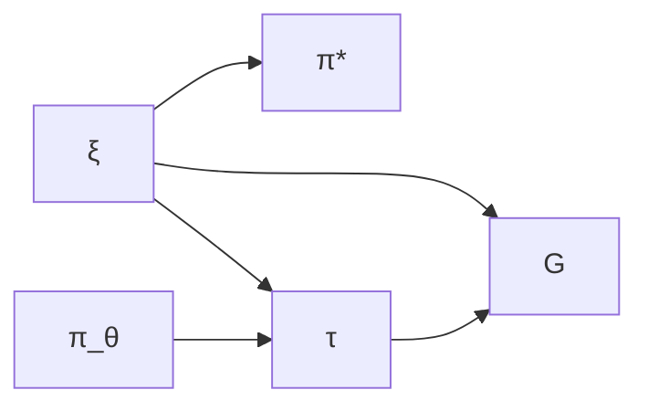
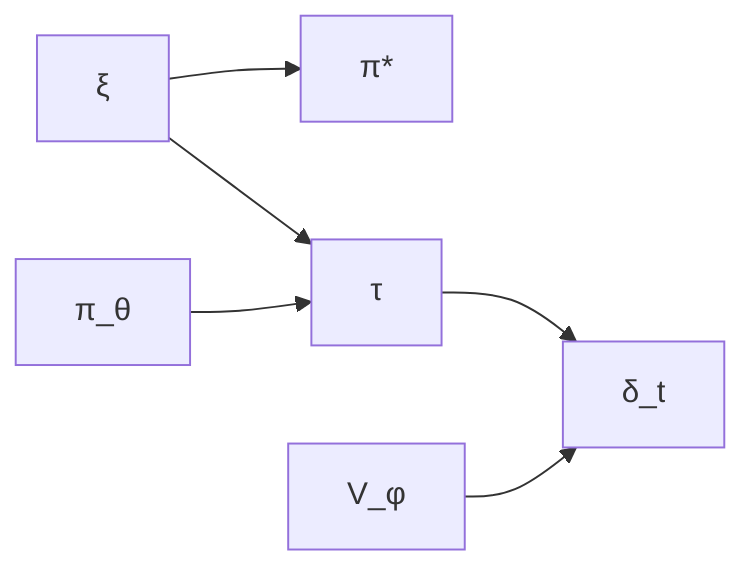

## Introduction

When I first read the "[LoRA Without Regret](https://thinkingmachines.ai/blog/lora/)" blog post, one claim stopped me in my tracks: policy gradient algorithms learn roughly **1 bit of information per episode**. Just one bit! And yet, this single insight elegantly explains why LoRA—with its mere thousands of trainable parameters—works so remarkably well for RL fine-tuning of large language models.

But I had to ask: what does "1 bit per episode" actually mean in a rigorous sense? And if policy gradients learn so little per episode, how much do other RL algorithms learn? Are we leaving massive gains on the table?

In this post, I'll work through a mathematically rigorous answer to these questions. The key insight is to use the **Bayesian RL framework** applied specifically to **autoregressive token generation**—a setting where:
- The MDP structure is explicit and concrete
- Transitions are deterministic and known (just token concatenation!)
- All the uncertainty lives in the reward function

This turns out to be both theoretically clean and practically relevant for understanding RL-based LLM fine-tuning.

---

## The Token-Level MDP Framework

### Autoregressive Generation as an MDP

Let's start by being precise about what we're actually doing when we fine-tune a language model with RL. Consider a typical setup: you're using RL to optimize for some task performance or align with human preferences.

**State Space**: $\mathcal{S} = \mathcal{V}^*$ where $\mathcal{V}$ is the vocabulary
- A state $s = (x_1, \ldots, x_t)$ is a sequence of tokens
- Initial state: $s_0 = \emptyset$ or a prompt

**Action Space**: $\mathcal{A} = \mathcal{V}$
- An action $a$ is selecting the next token from the vocabulary

**Transition Dynamics**: $P(s' | s, a)$ is deterministic
- If $s = (x_1, \ldots, x_t)$ and $a = x_{t+1}$, then $s' = (x_1, \ldots, x_t, x_{t+1})$
- Formally: $P(s \circ a | s, a) = 1$ (concatenation)
- **Key property**: Transitions are deterministic and known—no uncertainty here

**Reward Function**: $R_\xi: \mathcal{S} \to \mathbb{R}$
- Parameterized by unknown $\xi$ (representing human preferences, task objectives, etc.)
- Typically sparse: $R_\xi(s) = 0$ for all non-terminal states, $R_\xi(s_T) \neq 0$ for terminal states
- **This is what we must learn about**

**Episode**: Generate a sequence until a terminal condition (max length or EOS token)


$$\tau = (s_0, a_0, s_1, a_1, \ldots, s_{T-1}, a_{T-1}, s_T)$$


where $s_t = (x_1, \ldots, x_t)$ and $a_t = x_{t+1}$.

**Policy**: $\pi_\theta(a | s) = \pi_\theta(x_{t+1} | x_1, \ldots, x_t)$
- The language model's next-token distribution

**Objective**: Maximize expected reward


$$J(\theta; R_\xi) = \mathbb{E}_{\tau \sim \pi_\theta}\left[\sum_{t=0}^{T-1} \gamma^t R_\xi(s_t)\right]$$


Often simplified (sparse rewards): $J(\theta; R_\xi) = \mathbb{E}_{\tau \sim \pi_\theta}[R_\xi(s_T)]$

---

### The Bayesian RL Formulation

Here's where things get interesting. Instead of treating the reward function as fixed and known, let's be honest: we're uncertain about what the "right" reward function is. Maybe we're learning human preferences, or trying to figure out what makes a good code completion, or optimizing for some task we only partially understand.

So let's model this uncertainty explicitly with a **prior distribution** $p(\xi)$ over reward parameters $\xi$.

**Examples of** $\xi$:
- **Preference learning**: $\xi$ represents human preferences (parameters of a reward model)
- **Task learning**: $\xi$ indexes different task specifications
- **Objective optimization**: $\xi$ represents aspects of desired behavior

**Induced Distribution over Optimal Policies**: For each reward function $R_\xi$, there is an optimal policy:


$$\pi^*_\xi = \arg\max_\pi J(\pi; R_\xi)$$


**Assumption (Unique Optimum)**: We assume that for each $\xi$, the optimal policy $\pi^*_\xi$ is unique. This holds generically when:
- The action space is continuous (as in LLMs with softmax over large vocabularies)
- We use lexicographic tie-breaking in discrete cases
- The reward function has sufficient structure to avoid exact ties

Under this assumption, the prior $p(\xi)$ induces a distribution $p(\pi^*)$ where $\pi^* = \pi^*_\xi$ and $\xi \sim p(\xi)$.

**Critical Point**: This makes $\pi^*$ a **random variable** with a well-defined probability distribution, allowing us to rigorously compute:
- $H(\pi^*)$: Entropy of the optimal policy (we use differential entropy for continuous policy parameters)
- $I(S; \pi^*)$: Mutual information between learning signals and optimal policy
- $H(\pi^* | \mathcal{D})$: Posterior entropy after observing data

**Note on Entropy**: For continuous policy spaces (e.g., neural network parameters $\theta \in \mathbb{R}^d$), we use differential entropy. The key quantities $I(S; \pi^*)$ remain well-defined and measure reduction in uncertainty, even if $H(\pi^*)$ itself may be infinite in the continuous case.

**Learning Objective**: Reduce uncertainty about $\pi^*$ by observing trajectories.

---

### Information Theory Foundations

Before diving into the analysis, let's review the information-theoretic tools we'll need. If you're comfortable with entropy and mutual information, feel free to skim this section—but I want to be explicit about the machinery we're using.

**Entropy**: For discrete random variable $X$:


$$H(X) = -\sum_{x} p(x) \log_2 p(x)$$


Measures average uncertainty (in bits).

**Conditional Entropy**:


$$H(X | Y) = \sum_{y} p(y) H(X | Y=y) = -\sum_{x,y} p(x,y) \log_2 p(x|y)$$


Average uncertainty in $X$ after observing $Y$.

**Mutual Information**:


$$I(X; Y) = H(X) - H(X | Y) = H(Y) - H(Y | X)$$


Amount of uncertainty reduction: how much learning $Y$ tells us about $X$.

**Key Properties**:
1. Symmetry: $I(X; Y) = I(Y; X)$
2. Non-negativity: $I(X; Y) \geq 0$
3. Bounded: $I(X; Y) \leq \min(H(X), H(Y))$
4. Chain rule: $I(X; Y, Z) = I(X; Y) + I(X; Z | Y)$

---

### Data Processing Inequality: The Key Tool

The Data Processing Inequality (DPI) is going to be our workhorse theorem. The intuition is beautiful: you can't create information by processing it. Every transformation, every function application, every summary—it can only lose information or preserve it, never create it from thin air.

Let me state this precisely. For a **Markov chain** $X \to Y \to Z$, the variables satisfy:


$$p(z | x, y) = p(z | y)$$


Meaning: $X$ and $Z$ are conditionally independent given $Y$.

**Data Processing Inequality (DPI)**:
If $X \to Y \to Z$, then:


$$I(X; Z) \leq I(X; Y)$$


**Proof**:


$$\begin{align}
I(X; Y, Z) &= I(X; Y) + I(X; Z | Y)\\
&= I(X; Y) + 0 \quad \text{(by conditional independence)}\\
&= I(X; Y)
\end{align}$$


Also:


$$\begin{align}
I(X; Y, Z) &= I(X; Z) + I(X; Y | Z)\\
&\geq I(X; Z) \quad \text{(since } I(X; Y | Z) \geq 0\text{)}
\end{align}$$


Therefore: $I(X; Z) \leq I(X; Y, Z) = I(X; Y)$.

**Intuition**: Processing information through a chain can only lose information, never create it.

---

**DPI for Deterministic Functions**:

A special case that we'll use frequently is when $Z = f(Y)$ is a deterministic function of $Y$. This implies the Markov chain $X \to Y \to Z$, because knowing $Y$ fully determines $Z$, making $Z$ conditionally independent of $X$. The Data Processing Inequality therefore applies directly:


$$I(X; f(Y)) \leq I(X; Y)$$


**Intuition**: Applying a deterministic function $f$ can only reduce or preserve information, never create it.

**Application to RL**: Since the optimal policy $\pi^* = \pi^*_\xi$ is a deterministic function of the reward parameter $\xi$, we can establish:


$$I(S; \pi^*) = I(S; \pi^*_\xi) \leq I(S; \xi)$$


**Proof**: The equality $I(S; \pi^*) = I(S; \pi^*_\xi)$ holds by definition since $\pi^* = \pi^*_\xi$. For the inequality, since $\pi^*_\xi$ is a deterministic function of $\xi$, we have $I(S; \pi^* | \xi) = 0$ (knowing $\xi$ fully determines $\pi^*$). By the chain rule:


$$I(S; \pi^*, \xi) = I(S; \xi) + I(S; \pi^* | \xi) = I(S; \xi)$$


Also, $I(S; \pi^*, \xi) \geq I(S; \pi^*)$ since observing more variables cannot decrease mutual information. Therefore $I(S; \pi^*) \leq I(S; \xi)$.

This bound holds despite $S$ depending on both $\xi$ (through rewards) and $\pi_\theta$ (through trajectory generation)—it relies only on $\pi^*$ being uniquely determined by $\xi$.

---

### 2.5 Measuring Information in RL

**Learning Signal**: An RL algorithm processes trajectory $\tau$ and computes signal $S(\tau)$ for updates.

In our Bayesian framework, both $S$ and $\pi^*$ are random variables:
- $S$ depends on: $\xi \sim p(\xi)$ (determines rewards), $\pi_\theta$ (generates trajectories), stochasticity
- $\pi^*$ depends on: $\xi \sim p(\xi)$ (determines optimal behavior)

**Potential Information Bandwidth** (Signal Capacity):


$$\mathcal{B}_{\text{potential}} = H(S)$$


The entropy of the learning signal measures its maximum information capacity.

**Effective Information Bandwidth** (Learning About Optimal Policy):


$$\mathcal{B}_{\text{effective}} = I(S; \pi^*)$$


The mutual information measures how much the signal reduces uncertainty about the optimal policy.

**Fundamental Relationship**:


$$\mathcal{B}_{\text{effective}} = I(S; \pi^*) \leq H(S) = \mathcal{B}_{\text{potential}}$$


**The Gap**:


$$\mathcal{B}_{\text{potential}} - \mathcal{B}_{\text{effective}} = H(S | \pi^*)$$


This is the conditional entropy: the remaining uncertainty in $S$ even if we knew $\pi^*$. It represents noise or task-irrelevant information.

---

## Analysis of RL Algorithms

Now we get to the heart of the matter: how much information do different RL algorithms actually gather per episode?

### Policy Gradient (REINFORCE): The 1-Bit Bottleneck

**Algorithm**:
1. Sample trajectory: $\tau = (s_0, a_0, \ldots, s_T)$ where $s_t = (x_1, \ldots, x_t)$
2. Observe reward: $r = R_\xi(s_T)$ (sparse reward at episode end)
3. Compute return: $G = r$ (or discounted return if intermediate rewards exist)
4. Update: $\theta \leftarrow \theta + \alpha \nabla_\theta \log p_\theta(\tau) \cdot G$

**Learning Signal**: $S = G$ (scalar return value)

---

**Rigorous Analysis**:

**Step 1**: Identify the probabilistic structure.

The joint distribution over all variables is:


$$p(\xi, \pi_\theta, \tau, G, \pi^*) = p(\xi) \cdot p(\pi_\theta) \cdot p(\tau | \pi_\theta, \xi) \cdot \delta(G - R_\xi(s_T)) \cdot \delta(\pi^* - \pi^*_\xi)$$


The dependencies form a directed acyclic graph (DAG):



Where:
- $\xi \sim p(\xi)$: Prior over reward parameters
- $\pi_\theta$: Current policy (fixed/given)
- $\tau \sim p(\tau | \pi_\theta, \xi)$: Trajectory generated by policy receiving rewards from $R_\xi$
- $G = R_\xi(s_T)$: Return (deterministic function of $\tau$ and $\xi$)
- $\pi^* = \pi^*_\xi$: Optimal policy (deterministic function of $\xi$)

**Key observation**: This is NOT a Markov chain $G \to \xi \to \pi^*$ because $G$ depends on both $\xi$ (which rewards) and $\pi_\theta$ (which trajectory), while $\pi^*$ depends only on $\xi$.

**Step 2**: Apply the correct form of the Data Processing Inequality.

Since $\pi^* = \pi^*_\xi$ is a deterministic function of $\xi$, we can apply the DPI:

For any random variables $X$ and $Y$, and deterministic function $f$:


$$I(X; f(Y)) \leq I(X; Y)$$


**Proof**: Since $f$ is deterministic, $f(Y)$ is conditionally independent of $X$ given $Y$: $p(f(Y)|X,Y) = p(f(Y)|Y)$. This establishes the Markov chain $X \to Y \to f(Y)$. By the Data Processing Inequality proven above (Section 2.4):


$$I(X; f(Y)) \leq I(X; Y)$$


Applied to our setting with $X = G$ and $Y = \xi$:


$$I(G; \pi^*) = I(G; \pi^*_\xi) \leq I(G; \xi)$$


This bound is rigorous and does not require a Markov chain assumption.

**Step 3**: Calculate Potential Bandwidth.

Here's the critical observation: the return $G$ is just a single scalar! Your language model generates maybe 1000 tokens, forming a rich trajectory through sequence space, and at the end you compress all of that down to one number. How much information can possibly survive that brutal compression?

The return depends on:
- The prior $\xi \sim p(\xi)$
- The policy $\pi_\theta$ (determines which sequences are generated)
- The generated sequence $s_T$

The entropy of this scalar signal is:


$$H(G) = H(R_\xi(s_T))$$


where the randomness comes from both $\xi$ and the sequence generation.

**Practical bound on return entropy**: In practice, reward signals have **limited effective precision** due to:
- Human feedback is often categorical (e.g., binary preferences, Likert scales)
- Reward models output bounded scores with finite precision
- Noise and stochasticity in reward observations

**Empirical observation**: Most RL systems use rewards that can be meaningfully distinguished into $B = 2$ to $B = 10$ levels. For example, with $B = 5$ bins (very negative, negative, neutral, positive, very positive):


$$H(G) \lesssim \log_2(5) \approx 2.32 \text{ bits}$$


More rigorously, even if rewards are continuous, the **mutual information** $I(G; \xi)$ is bounded by the effective distinguishability of reward signals. With $B$ effectively distinguishable reward levels:


$$I(G; \xi) \leq \log_2(B) = O(1)$$


This bound captures the practical information content of scalar reward signals: with $B = 2$ to $10$ distinguishable levels:


$$\mathcal{B}_{\text{potential}} = H(G) = 1\text{-}3.3 \text{ bits per episode}$$


**Step 4**: Analyze $I(G; \xi)$.

The return $G = R_\xi(s_T)$ is a single scalar observation that depends on:
- The reward function $R_\xi$ (what we're learning about)
- The generated sequence $s_T$ (determined by policy)

This is a many-to-one mapping: the entire sequence of $T$ tokens is compressed into one scalar value.

By the data processing inequality (information can only decrease through compression):


$$I(G; \xi) \leq H(G)$$


In fact, they are equal when the return is an invertible function of $\xi$ given $s_T$. But the effective constraint is:


$$I(G; \xi) \leq H(G) = O(1)$$


**Step 5**: Calculate Effective Bandwidth.

Using the DPI from Step 2:


$$\mathcal{B}_{\text{effective}} = I(G; \pi^*) \leq I(G; \xi) \leq H(G) = O(1)$$


**The "1 bit per episode" result**: This is where the original claim becomes precise. With $B = 2$ bins (basically "good" vs "bad"):


$$I(G; \pi^*) \leq \log_2(2) = 1 \text{ bit per episode}$$


Literally one bit! And even with more granular feedback—say $B = 4$ bins:


$$I(G; \pi^*) \leq \log_2(4) = 2 \text{ bits per episode}$$


We're still talking about a trickle of information.

---

**Summary**:

| Quantity | Value | Meaning |
|----------|-------|---------|
| Potential Bandwidth | $O(1)$ bits | Scalar signal has limited capacity |
| Effective Bandwidth | $\leq O(1)$ bits | At most $\log_2(B)$ bits where $B$ is number of distinguishable reward levels |
| Bottleneck | Episode-level compression | $T$ tokens → 1 scalar return |

{}
**Key insight**: Policy gradient compresses an entire sequence of $T$ tokens into a single scalar reward signal, creating a severe information bottleneck.
{}

---

### Actor-Critic: Unlocking Token-Level Information

So policy gradients learn 1-4 bits per episode. That's... not much. But what if we could get a learning signal at *every* token instead of just at the end? That's the promise of actor-critic methods.

**Algorithm**:
1. At each step $t$, given state $s_t = (x_1, \ldots, x_t)$:
2. Select action $a_t = x_{t+1} \sim \pi_\theta(\cdot | s_t)$
3. Observe reward $r_t = R_\xi(s_t)$ (typically 0 for non-terminal states)
4. Compute TD error: $\delta_t = r_t + \gamma V_\phi(s_{t+1}) - V_\phi(s_t)$
5. Update critic: $\phi \leftarrow \phi - \alpha_c \nabla_\phi (\delta_t)^2$
6. Update actor: $\theta \leftarrow \theta + \alpha_a \nabla_\theta \log \pi_\theta(a_t|s_t) \cdot \delta_t$

**Learning Signal**: $\{S_t = \delta_t\}_{t=0}^{T-1}$ (one per time step)

---

**Rigorous Analysis**:

**Step 1**: Identify the probabilistic structure.

The joint distribution is:


$$p(\xi, \pi_\theta, \tau, \{\delta_t\}, \pi^*) = p(\xi) \cdot p(\pi_\theta) \cdot p(\tau | \pi_\theta, \xi) \cdot p(\{\delta_t\} | \tau, V_\phi) \cdot \delta(\pi^* - \pi^*_\xi)$$


The dependencies form a DAG:



Where $V_\phi$ is the critic learned from past data.

**Step 2**: Apply the Data Processing Inequality.

As in the policy gradient analysis, we have $\pi^* = \pi^*_\xi$ as a deterministic function of $\xi$. While $\delta_t \to \xi \to \pi^*$ is NOT a Markov chain (since $\delta_t$ depends on $\xi$ through rewards, $\pi_\theta$ determining which states are visited, and $V_\phi$ providing critic estimates), we can still apply DPI using the deterministic function property:


$$I(\delta_t; \pi^* | \text{history}) = I(\delta_t; \pi^*_\xi | \text{history}) \leq I(\delta_t; \xi | \text{history})$$


This bound follows from the general principle that for any deterministic function $f$, $I(X; f(Y)) \leq I(X; Y)$, which holds regardless of the relationship between $X$ and $Y$.

**Step 3**: Calculate Potential Bandwidth.

Each TD error $\delta_t$ is a scalar. Assuming we discretize into $B_\delta$ bins:


$$H(\delta_t | \text{history}) \leq \log_2(B_\delta) = O(1)$$


Since we have $T$ steps (one per token generated):


$$\mathcal{B}_{\text{potential}} = \sum_{t=0}^{T-1} H(\delta_t | \text{history}) = T \cdot O(1) = O(T) \text{ bits}$$


{}
**Key difference from policy gradient**: We get a learning signal at **every token**, not just at episode end.
{}

**Step 4**: Analyze $I(\delta_t; \xi | \text{history})$.

The TD error contains:


$$\delta_t = r_t + \gamma V_\phi(s_{t+1}) - V_\phi(s_t)$$


In the sparse reward case (common for language models), $r_t = 0$ except at terminal states. But even when $r_t = 0$, the TD error provides information about $\xi$ through the value function updates.

**For terminal states** ($t = T$):


$$\delta_T = R_\xi(s_T) - V_\phi(s_T)$$


This directly observes the reward, giving:


$$I(\delta_T; \xi | s_T) = O(1)$$


**For non-terminal states**: The value function $V_\phi(s_t)$ estimates expected future rewards under the current policy. As the critic learns, it accumulates information about $\xi$ from past episodes.

**Step 5**: Sum over trajectory.

Using the chain rule for mutual information:


$$I(\{\delta_t\}_{t=0}^{T-1}; \xi) = \sum_{t=0}^{T-1} I(\delta_t; \xi | \{\delta_k\}_{k < t})$$


Each step can provide new information about $\xi$, but the total is bounded by:


$$I(\{\delta_t\}; \xi) \leq \sum_{t=0}^{T-1} H(\delta_t | \text{history}) = O(T)$$


**Step 6**: Calculate Effective Bandwidth.


$$\mathcal{B}_{\text{effective}} = I(\{\delta_t\}; \pi^*) \leq I(\{\delta_t\}; \xi) \leq O(T)$$


**The role of the critic**: The effective bandwidth depends on critic quality:

| Training Phase | Critic State | $I(\{\delta_t\}; \xi)$ | Effective Bandwidth |
|----------------|--------------|------------------------|---------------------|
| Early | Random $V_\phi$ | Low | $\ll O(T)$ |
| Middle | Improving | Growing | $\to O(T)$ |
| Late | Converged | High | $\approx O(T)$ |

When the critic is well-trained, $V_\phi(s_t)$ approximates true expected rewards, and the TD errors become informative about $\xi$ throughout the trajectory.

**Important caveat**: The $O(T)$ bandwidth is an **upper bound** that requires a well-trained critic. In practice, especially early in training or without careful critic tuning, the effective bandwidth may be much lower. The TD errors at different timesteps may also be correlated (not providing independent information), further reducing the effective bandwidth below the theoretical maximum.

**Correlation between TD errors**: In practice, TD errors at successive timesteps are often correlated, particularly in long sequences. This correlation reduces the effective information rate compared to the $T \cdot O(1)$ upper bound.

**Rigorous bound**: Even with correlation, the information still scales as $O(T)$, but with a reduced constant. If $\delta_t = \rho \delta_{t-1} + \epsilon_t$ where innovations $\epsilon_t$ are independent with $H(\epsilon_t) = c$ bits, then:


$$I(\{\delta_t\}; \xi) \leq T \cdot c \cdot f(\rho)$$


where $f(\rho) < 1$ is a decreasing function of correlation strength. For example, with $\rho = 0.7$, the effective constant might be reduced by a factor of $2$-$5\times$ compared to independent observations.

This correlation arises because:
- Consecutive states share most tokens (only one token differs)
- Value estimates propagate through bootstrapping
- Policy changes affect multiple timesteps similarly

While the asymptotic scaling remains $O(T)$, the reduced constant factor partially explains why actor-critic methods for LLMs haven't achieved the full theoretical improvement over policy gradient. Additionally, **optimization difficulties** in training the critic further reduce practical gains.

---

**Summary**:

| Quantity | Value | Meaning |
|----------|-------|---------|
| Potential Bandwidth | $O(T)$ bits | Dense signal: one per token |
| Effective Bandwidth | $\leq O(T)$ bits | Achievable when critic is trained |
| Improvement over PG | $T \times$ | For $T=1000$ tokens, $1000\times$ more bandwidth |

{}
**Key insight**: Actor-critic provides learning signals at every token generation step, not just episode end, yielding $T\times$ more information capacity.
{}

---

## Synthesis and Implications

Let's step back and see what we've learned.

### The Big Picture Comparison

| Algorithm | Signal | Potential BW | Effective BW | Notes |
|-----------|--------|--------------|--------------|-------|
| Policy Gradient | Episode return $G$ | $O(1)$ | $\leq O(1)$ | Sparse: 1 signal per episode |
| Actor-Critic | TD errors $\{\delta_t\}$ | $O(T)$ | $\leq O(T)$ | Dense: 1 signal per token |

**Key Insights**:

1. **Signal density determines bandwidth**: Episode-level ($O(1)$) vs. token-level ($O(T)$) makes a $T\times$ difference

2. **For language models with sparse rewards**:
   - Policy gradient: $\sim 1$-$4$ bits per episode
   - Actor-critic: $\sim T$ bits per episode where $T$ is sequence length
   - If $T = 1000$ tokens, actor-critic has $250$-$1000\times$ more bandwidth

3. **Token-level MDP clarifies everything**: No need to assume unknown dynamics—transitions are deterministic concatenation

---

### Why LoRA Works: The Complete Picture

Now we can finally give a satisfying answer to the original question: why does LoRA work so well for RL fine-tuning?

The key is matching capacity to information flow. Let's work through the numbers.

**Prior**: Pre-trained model gives us prior $p(\xi)$ over reward functions (implicitly, from pre-training on diverse text data).

**Information Accumulation**:

After $N$ episodes of policy gradient, total information gained:


$$I(\{G_1, \ldots, G_N\}; \pi^*) = \sum_{i=1}^{N} I(G_i; \pi^* | \{G_j\}_{j < i})$$


**Key insight**: Each term $I(G_i; \pi^* | \{G_j\}_{j < i})$ represents the **marginal information** from episode $i$. This decreases as training progresses due to:
1. **Redundancy**: Later episodes may visit similar states and observe similar rewards
2. **Saturation**: As $\pi_\theta$ approaches $\pi^*$, less new information is gained
3. **Correlation**: Episodes generated by the same (or similar) policy are not independent

**Bounding total information**: We have two constraints:

1. **Per-episode bound**: Each return provides at most $O(1)$ bits about $\pi^*$
2. **Total uncertainty bound**: $I_{\text{total}} \leq H(\pi^*)$ (cannot learn more than initial uncertainty)

**Practical regime**: In early/mid training where $N \cdot O(1) < H(\pi^*)$, marginal information per episode remains roughly $O(1)$, giving:


$$I_{\text{total}} \approx N \cdot c \text{ bits}$$


where $c \in [1, 4]$ depends on reward distinguishability. As training saturates, marginal gains decrease.

However, we also have the constraint that we cannot learn more than the initial uncertainty:


$$I_{\text{total}} \leq H(\pi^*)$$


{}
**Key Assumption for LoRA Analysis**: We analyze the learning regime where fine-tuning has not yet fully converged to $\pi^*$, i.e., $$N \cdot O(1) < H(\pi^*)$$, so the information accumulated is approximately $N \cdot O(1)$ bits.

This is reasonable for practical fine-tuning scenarios where $N \sim 10^3$ to $10^4$ episodes and the policy space is large. Once $I_{\text{total}}$ approaches $H(\pi^*)$, the learning rate necessarily slows as there is less remaining uncertainty to resolve.
{}

**Concrete numbers**: With $c = 2$ bits per episode (4-level rewards):
- After $N = 1000$ episodes: $\approx 2000$ bits $\approx 250$ bytes
- After $N = 10000$ episodes: $\approx 20000$ bits $\approx 2.5$ KB

**Important caveat**: These are **upper bounds** on useful information. Actual information about $\pi^*$ may be less due to noise and redundancy in episodes.

**LoRA Capacity Analysis**:

Rank-$r$ adapter for dimension-$d$ layer:
- Parameters: $2rd$ (two low-rank matrices)
- **Storage capacity**: $64rd$ bits (FP32 representation)

**Example**: $r = 8$, $d = 4096$ (typical for large LLMs):
- Parameters: $2 \times 8 \times 4096 = 65{,}536$
- Storage: $64 \times 8 \times 4096 = 2{,}097{,}152$ bits $= 256$ KB

**Capacity comparison**:


$$\frac{\text{LoRA storage capacity}}{\text{Information from RL}} = \frac{256 \text{ KB}}{2.5 \text{ KB}} \approx 100\times$$


LoRA has **100 times** more capacity than the information we're trying to store! And even after 10,000 episodes ($\sim 20$ KB of information), LoRA still has $\sim 10\times$ headroom.

**Why this comparison is meaningful**: Sure, storage bits and information bits are different concepts—a 1GB hard drive doesn't mean you've learned 1GB of information. But the argument still holds: the **change** in the LoRA parameters from their initial state must *encode* the policy-relevant information learned through RL. If policy gradient provides only $\sim 2N$ bits of information to guide this change, and LoRA provides a much larger parameter space ($64rd$ bits) to store it, then the learning signal is the bottleneck, not the adapter's capacity.

{}
**Conclusion**: LoRA provides orders of magnitude more representational capacity than policy gradient delivers information. This explains why such low-rank adapters suffice—the learning signal is the bottleneck, not the adapter capacity.
{}

**Why full fine-tuning is wasteful**: And if you thought the LoRA numbers were striking, look at full fine-tuning. A 7B parameter model has storage capacity $7\text{B} \times 32 = 224$ GB (in FP32):


$$\frac{7\text{B} \times 32 \text{ bits}}{2000 \text{ bits}} \approx 100{,}000{,}000\times \text{ excess capacity}$$


That's **100 million times** more capacity than policy gradient can fill in a typical training run. No wonder people were overfitting!

---

### 4.3 Sample Complexity: An Information-Theoretic Perspective

**Information-theoretic lower bound**:

To reduce uncertainty about $\pi^*$ from prior entropy $H(\pi^*)$ to posterior entropy $\epsilon$:


$$I_{\text{required}} = H(\pi^*) - \epsilon$$


**Translating to sample complexity**: If each episode provides $I_{\text{per-episode}}$ bits:


$$N \geq \frac{I_{\text{required}}}{I_{\text{per-episode}}}$$


**For different algorithms**:
- **Policy gradient**: $I_{\text{per-episode}} = 1\text{-}4$ bits (with typical reward discretization) → $N_{\text{PG}} = \Omega(H(\pi^*)/c)$ where $c \in [1,4]$
- **Actor-critic**: $I_{\text{per-episode}} = O(T)$ → $N_{\text{AC}} = \Omega(H(\pi^*)/T)$

**Important caveats**:
1. Assumes information accumulates **additively** (ignores redundancy between episodes)
2. Real sample complexity depends on **optimization dynamics** (gradient descent may need more samples than information theory suggests)
3. Assumes **perfect utilization** of information (in practice, some information is "wasted")
4. Actor-critic requires **well-trained critic** to achieve $O(T)$ bandwidth

**Example (illustrative)**: If $H(\pi^*) \approx 10{,}000$ bits and $T = 1000$ tokens:
- Policy gradient: $\gtrsim 2{,}500$ to $10{,}000$ episodes
- Actor-critic: $\gtrsim 10$ to $1{,}000$ episodes (depending on critic quality)
- **Gap**: $10\times$ to $1000\times$ improvement possible

These are **order-of-magnitude estimates** that explain qualitative differences observed empirically, not rigorous sample complexity theorems.

---

### Implications for LLM-RL

So what should we actually do with these insights? Let me highlight what I think are the most important practical implications.

**1. Dense vs. Sparse Rewards**:
- Sparse (outcome-based): Reward only at sequence end → $O(1)$ bits/episode
- Dense (token-level): Reward at each token → $O(T)$ bits/episode
- **Current limitation**: Most LLM-RL uses sparse rewards (RLHF with binary preferences)
- **Research opportunity**: Develop methods for meaningful token-level reward signals

**2. The Value-Based RL Gap**:

Here's what keeps me up at night: our analysis shows that actor-critic methods should theoretically achieve $\sim T\times$ better sample efficiency than policy gradient. In traditional RL domains, PPO (actor-critic) requires $\sim 100\times$ fewer samples than REINFORCE. We have existence proofs that this works!

**And yet, for LLMs:**
- **Current state**: No established training recipes for value function learning at scale
- **Key challenges**:
  - Value function training is unstable for large language models
  - Critic networks require careful initialization and hyperparameter tuning
  - Bootstrap error accumulation in long sequences ($T \sim 1000$ tokens)
  - Computational overhead of maintaining and updating critics

**Why this matters from an information-theoretic perspective**:
- Current RLHF with policy gradient is limited to $O(1)$ bits/episode
- Successfully training critics could unlock $O(T) = O(1000)$ bits/episode
- This represents a $1000\times$ potential improvement in information bandwidth

**3. Research Directions: Value-Based RL for LLMs**:

From our information-theoretic analysis, developing effective value-based methods for LLMs is the highest-leverage research direction:

a) **Stable Critic Training**:
   - **Challenge**: Value function learning at LLM scale
   - **Information perspective**: Each successful critic update should provide $O(1)$ bits about $\xi$ per token
   - **Research questions**: 
     - What architectures enable stable value learning?
     - How to handle long-horizon credit assignment ($T \sim 1000$)?
     - Can we leverage pre-trained representations?

b) **Alternative Value Representations**:
   - **Approach**: Instead of learning $V_\phi(s_t)$, learn compressed value representations
   - **Information perspective**: The critic need only capture $O(T)$ bits about expected rewards
   - **Concrete ideas**:
     - Low-rank value functions
     - Hierarchical value decomposition
     - Outcome-conditioned value models

c) **Hybrid Approaches**:
   - **Monte Carlo + TD**: Use sparse rewards but dense value targets
   - **Model-based value learning**: Use reward models to generate dense pseudo-rewards
   - **Information gain**: Even partial value information could provide $O(T/k)$ bits for some $k < T$

**4. LoRA Rank Selection (For Current Policy Gradient Methods)**:

Given that we currently use policy gradient with $O(1)$ bits/episode:

Information accumulated in $N$ episodes: $\sim N \cdot 2$ bits (with 4-bin returns)

Choose rank $r$ such that: $64rd \geq 2N$

For $d = 4096$, $N = 1000$: $r \geq 1$ is sufficient!

In practice, $r = 8$ or $r = 16$ provides ample margin.

**5. Multi-Task Learning**:
If fine-tuning on $K$ tasks simultaneously, information accumulation scales:


$I_{\text{total}} = N \cdot O(K)$


This explains why multi-task RL may benefit from higher-rank adapters.

---

### 4.5 Scope and Applicability

#### 4.5.1 When This Analysis Applies

**This information-theoretic framework is most applicable when:**

1. **Stationary reward functions**: The analysis assumes $\xi$ is fixed. For continually evolving preferences or non-stationary objectives, the effective bandwidth must also account for tracking a moving target.

2. **Pure policy learning**: We focus on learning which policy is optimal, not exploration. Information-directed sampling or active learning would have different bandwidth properties.

3. **Known dynamics**: For token-level MDPs with deterministic transitions. Agentic settings with unknown stochastic dynamics require additional bandwidth for learning transition models (see Section 4.7).

4. **Optimization is not the bottleneck**: We measure information provided to the learning algorithm, not whether gradient descent can utilize it effectively. Poor optimization can waste available bandwidth.

**This analysis may not directly apply to:**

1. **Partial observability**: If the agent cannot observe the full state, additional bandwidth is needed to infer hidden information.

2. **Exploration-exploitation settings**: The framework assumes we're learning from a fixed policy distribution, not actively exploring to gain information.

3. **Multi-task or continual learning**: Interference between tasks and catastrophic forgetting introduce additional constraints beyond information bandwidth.

4. **Adversarial or strategic environments**: When the environment responds to the policy, game-theoretic considerations matter beyond pure information flow.

---

### 4.6 Fundamental Trade-offs

**1. Signal Density vs. Computational Cost**
- Dense signals: $O(T)$ bandwidth but requires critic, more computation per step
- Sparse signals: $O(1)$ bandwidth but simpler algorithm, less computation
- **Trade-off**: Sample efficiency vs. computational efficiency

**2. Prior Strength vs. Learning Speed**
- Strong prior (good pre-training): Low $H(\pi^* | \text{prior})$, fast fine-tuning
- Weak prior: High $H(\pi^* | \text{prior})$, slow fine-tuning
- **Recommendation**: Invest in high-quality pre-training for faster RL fine-tuning

**3. Adapter Capacity vs. Catastrophic Forgetting**
- Low-rank adapters: Limited capacity, preserves pre-training
- Full fine-tuning: High capacity, risks forgetting
- **Insight**: Policy gradient's low bandwidth naturally matches low-rank adapters, avoiding forgetting

---

## Conclusion

Let me summarize what we've learned and where I think this leaves us.

### Main Results

We've established a rigorous information-theoretic framework for RL in autoregressive generation:

**1. Token-Level MDP Formulation**
- States: Token sequences $s = (x_1, \ldots, x_t)$
- Actions: Next token $a = x_{t+1}$
- Transitions: Deterministic concatenation (known)
- Rewards: Parameterized by unknown $\xi$

**2. Bayesian Framework Makes** $I(S; \pi^*)$ **Well-Defined**
- Prior $p(\xi)$ over reward parameters
- Induces distribution over optimal policies $p(\pi^*)$
- Both $S$ and $\pi^*$ are random variables

**3. Rigorous Information Bandwidth Results**
- Policy gradient: $\mathcal{B}_{\text{effective}} = 1\text{-}4$ bits per episode (depending on reward distinguishability)
- Actor-critic: $\mathcal{B}_{\text{effective}} = O(T)$ bits per episode (upper bound requiring well-trained critic)
- Difference: $T\times$ where $T$ is sequence length ($\sim 100$-$1000\times$ theoretical, less in practice due to TD error correlation)

**4. LoRA Explained**
- Policy gradient accumulates $O(N)$ bits over $N$ episodes
- LoRA capacity: $64rd$ bits ($\sim 100{,}000\times$ more than needed)
- Perfect match between limited information and limited capacity

**5. Sample Complexity Predictions**
- Policy gradient: $\Omega(H(\pi^*))$ episodes
- Actor-critic: $\Omega(H(\pi^*)/T)$ episodes
- Explains $100$-$1000\times$ empirical differences

### Open Questions and Research Directions

If I had to bet on where the next major breakthrough in LLM RL will come from, it would be solving these problems:

**1. The Value Function Challenge** (Highest Priority):

How can we develop stable, scalable methods for training value functions on LLMs?
- **Information gain**: Could unlock $\sim 1000\times$ improvement (from $O(1)$ to $O(1000)$ bits/episode)
- **Key obstacles**: Training stability, long-horizon credit assignment, computational overhead
- **Promising directions**: Low-rank critics, hierarchical decomposition, better initialization

**2. Token-Level Reward Design**:

Can we design meaningful dense reward signals without human annotation at every token?
- **Current**: Sparse outcome-based rewards ($O(1)$ bits/episode)
- **Potential**: Token-level rewards ($O(T)$ bits/episode)
- **Approaches**: Automated reward shaping, proxy signals, model-based pseudo-rewards

**3. Information-Efficient Exploration**:

How should we design exploration strategies to maximize $I(S; \pi^*)$ per token?
- Traditional RL uses entropy bonuses, but these don't target information about $\xi$
- **Information-directed sampling**: Choose actions to maximize expected information gain about reward function

**4. Multi-Objective RL**:

How does information bandwidth extend to multiple reward functions $\{\xi_i\}_{i=1}^K$?
- Does learning about one objective help with others?
- How should we allocate limited bandwidth across objectives?

**5. Continual Learning Dynamics**:

As policy updates, the trajectory distribution $p(\tau | \pi_\theta, \xi)$ changes. How does this affect:
- Information accumulation rate over training?
- The relationship between bandwidth and convergence speed?
- Optimal learning rate schedules from an information perspective?

### Practical Recommendations

For practitioners fine-tuning LLMs with RL:

**Current Best Practices (Policy Gradient Era)**:

1. **Use LoRA with small rank** ($r = 8$ to $16$) for policy gradient—our analysis shows full fine-tuning is wasteful given $O(1)$ bits/episode

2. **Expect slow convergence**: With $O(1)$ bits/episode, budget for thousands of episodes

3. **Invest in pre-training quality** to reduce $H(\pi^* | \text{prior})$ and speed up RL fine-tuning

4. **For multi-task learning**, scale LoRA rank proportionally to number of tasks ($I_{\text{total}} = N \cdot O(K)$)

**The $1000\times$ Opportunity**:

Our analysis reveals a massive opportunity: successfully training value functions for LLMs could improve sample efficiency by $\sim 1000\times$ (from $O(1)$ to $O(T)$ bits/episode where $T \sim 1000$).

**Priority Research Directions**:

1. **Develop stable critic training methods** for LLMs
   - Low-rank value functions
   - Better initialization strategies
   - Hierarchical value decomposition

2. **Design meaningful token-level rewards** (currently most methods use sparse, outcome-based rewards)

3. **Explore hybrid approaches** that partially capture $O(T)$ bandwidth:
   - Monte Carlo + TD methods
   - Model-based value learning with reward models
   - Outcome-conditioned value estimation

{}
**Current State**: The field currently lacks reliable value-based RL recipes for LLMs. From an information-theoretic perspective, this represents the single largest bottleneck in sample-efficient LLM RL training. Solving this problem could reduce training costs and data requirements by orders of magnitude.
{}

{}
The information-theoretic perspective not only explains current methods (why LoRA works, why training is slow) but also reveals where the highest-leverage research opportunities lie: unlocking the $O(T)$ bits/episode potential of value-based methods.
{}

---

### 4.7 Extension to Agentic RL and Model-Based Methods

**Note on Reasoning RL**: Our analysis focused on autoregressive token generation where transitions are deterministic and known (token concatenation). However, for **agentic RL settings** where language models interact with **external environments** (e.g., tool use, code execution, web browsing), the picture changes significantly.

**Model-Based RL in Agentic Settings**:

When transitions are **not** deterministic or known:
- **Learning Signal**: $\{S_t = (s_{t+1}, r_t)\}_{t=0}^{T-1}$ now contains information about both dynamics and rewards
- **Potential Bandwidth**: $O(T \log |\mathcal{S}|)$ bits per episode (observing next states provides $\log |\mathcal{S}|$ bits each step)
- **Effective Bandwidth**: Can be much higher than actor-critic when dynamics are unknown

**Key Distinction**:
- **Token-level MDP** (this analysis): Transitions known → model-based ≈ actor-critic
- **Agentic RL**: Transitions unknown → model-based has information advantage

**Information Allocation**: In agentic settings, the agent may learn both:
1. $P(s' | s, a)$: Transition dynamics (how the environment responds)
2. $R_\xi(s)$: Reward function (what the user wants)

Model-based methods can learn both simultaneously, potentially achieving higher total information bandwidth. However, in pure reasoning RL (e.g., chain-of-thought, internal planning), transitions remain deterministic and our analysis applies directly.

---

## Appendix: Scope and Limitations

**What this analysis rigorously establishes**:
1. ✅ Policy gradient uses scalar signals with $O(1)$ bit capacity per episode
2. ✅ Actor-critic uses token-level signals with $O(T)$ bit capacity per episode
3. ✅ The qualitative conclusion: dense signals provide $T\times$ more information bandwidth
4. ✅ LoRA's storage capacity vastly exceeds information provided by policy gradient

**What requires additional assumptions**:
1. ⚠️ Exact sample complexity bounds (requires analysis of optimization dynamics)
2. ⚠️ Linear accumulation of information (assumes limited redundancy across episodes)
3. ⚠️ Actor-critic achieving $O(T)$ bandwidth (requires well-trained critic)
4. ⚠️ Reward distinguishability (assumes $O(1)$ effective precision)

**What remains qualitative**:
1. 📊 Specific constants (exact bits per distinguishable reward level)
2. 📊 Saturation dynamics (when marginal information gain decreases)
3. 📊 Relationship between storage bits and representational capacity in neural networks

**Perspective**: This analysis provides an **information-theoretic lens** for understanding RL efficiency in LLM fine-tuning. The mathematical framework is rigorous, but translating information-theoretic bounds to concrete sample complexity requires additional assumptions about optimization and learning dynamics. The value lies in the **qualitative insights** and **order-of-magnitude comparisons**, which align well with empirical observations and provide intuition for why certain methods work.

---

## Further Reading

- Russo & Van Roy (2014), "Learning to Optimize via Information-Directed Sampling"
- Ouyang et al. (2022), "Training language models to follow instructions with human feedback" (InstructGPT)
- Hu et al. (2021), "LoRA: Low-Rank Adaptation of Large Language Models"
- Cover & Thomas (2006), "Elements of Information Theory"

---

## Citation

If you found this post useful in your research, please consider citing it:

```bibtex
@article{li2025information,
  title   = {Information Bandwidth in Reinforcement Learning: Understanding Why Policy Gradient Learns 1 Bit Per Episode},
  author  = {Li, Yingru},
  journal = {Richard Li's Blog},
  year    = {2025},
  month   = {October},
  url     = {https://richardli.xyz/post/information-bandwidth-rl/}
}
```


### Did you find this post helpful? Consider sharing it 🙌